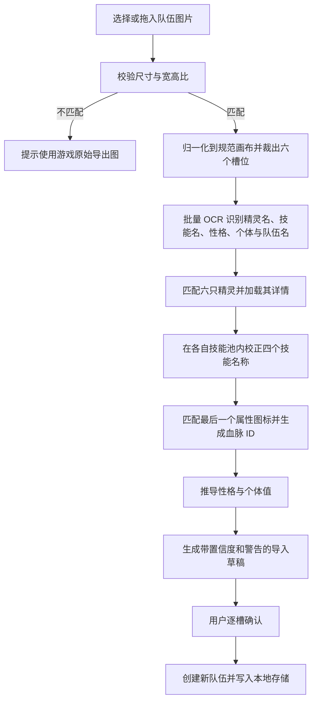

# 配队图片快速导入

本文记录游戏固定格式“队伍配置图片”的导入实现与后续校准方式。用户在手机或桌面端上传一张队伍图后，可生成六个配队槽位，并在写入前逐项确认。

## 当前实现

- `/team` 的队伍管理区已增加“图片导入”，支持选择或拖入 PNG/JPEG（最大 20MB）。
- 图片、OCR 和图标匹配均在浏览器内完成；ONNX Runtime 的 JS/WASM 随应用构建，中文模型首次使用时下载并由浏览器缓存。
- 首次样例 `IMG_7076.PNG` 端到端验证结果：6/6 精灵、6/6 性格、6/6 个体方向、6/6 普通血脉成功回填；24 个技能中 19 个自动匹配，其余 5 个保留为“暂不导入”。
- 识别结果默认创建新队伍，经过现有队伍存储与详情加载流程后仍可继续编辑。
- 污染血脉会被拦截，首版不写入队伍。

## 设计结论

首版采用纯浏览器的混合识别方案：

1. 固定版式归一化与坐标裁剪。
2. PaddleOCR.js 识别精灵名、技能名、性格属性、个体资质属性和队伍名。
3. 技能直接裁剪图标下方的黑底白字名称栏，通过受精灵技能池约束的 OCR 结果匹配，不识别技能图标。
4. 精灵名后有 2-3 个属性图标，固定取最后一个图标作为血脉属性，并与属性图标模板匹配。
5. 所有结果先进入确认页，默认创建新队伍，不直接覆盖当前队伍。

该方案不需要上传原图或配置云端 API 密钥，没有按次识别费用。OCR 模型按需加载并缓存，代价主要是首次模型下载和设备本地计算。

## 属性图标图集

已确认游戏解包文件 `Species.png` 就是队伍导出图使用的属性图标图集。原图尺寸为 `512×256`，有效图标位于左上角约 `282×232` 区域，按 5 列 × 4 行排列；其余区域透明。实现时建议保留完整原图，通过固定网格裁剪生成模板，不需要手工重画图标。

图集映射如下：

| 行列 | 名称 | `types.json` ID | 导入含义 |
| --- | --- | --- | --- |
| 1-1 | 草 | 2 | 普通属性血脉 |
| 1-2 | 普通 | 1 | 普通属性血脉 |
| 1-3 | 龙 | 8 | 普通属性血脉 |
| 1-4 | 电 | 9 | 普通属性血脉 |
| 1-5 | 幽 | 15 | 普通属性血脉 |
| 2-1 | 火 | 3 | 普通属性血脉 |
| 2-2 | 萌 | 14 | 普通属性血脉 |
| 2-3 | 空 | — | 忽略 |
| 2-4 | 毒 | 10 | 普通属性血脉 |
| 2-5 | 恶 | 16 | 普通属性血脉 |
| 3-1 | 水 | 4 | 普通属性血脉 |
| 3-2 | 武 | 12 | 普通属性血脉 |
| 3-3 | 污染 | — | 首版忽略，不作为可导入血脉 |
| 3-4 | 虫 | 11 | 普通属性血脉 |
| 3-5 | 机械 | 17 | 普通属性血脉 |
| 4-1 | 光 | 5 | 普通属性血脉 |
| 4-2 | 冰 | 7 | 普通属性血脉 |
| 4-3 | 幻 | 18 | 普通属性血脉 |
| 4-4 | 地 | 6 | 普通属性血脉 |
| 4-5 | 翼 | 13 | 普通属性血脉 |

图集单元格可先按约 `56×58` 的步长裁剪，再根据每格非透明像素边界做二次收紧。实际实现必须用自动化测试验证全部格子的裁剪结果，避免图集边缘扩张像素被截断。

## 样例版式

当前样例尺寸为 `1625×747`，主体区域为左侧约 81.5%，右侧橙色品牌与队伍名区域不参与槽位解析。六个槽位按 `2×3` 排列：

| 槽位 | 基准区域（x1, y1, x2, y2） |
| --- | --- |
| 1 | `49, 22, 666, 230` |
| 2 | `703, 22, 1302, 230` |
| 3 | `49, 270, 666, 478` |
| 4 | `703, 270, 1302, 478` |
| 5 | `49, 518, 666, 728` |
| 6 | `703, 518, 1302, 728` |

实现时先校验图片尺寸与宽高比，再缩放到 `1625×747` 的规范画布。当前版本针对游戏原始导出图的固定坐标解析；明显裁剪、加边框或宽高比异常时停止自动导入并提示重新导出原图。

每个槽位按相对坐标继续裁出：

- 精灵立绘：用于名称低置信度时的辅助匹配。
- 精灵名称：主要身份识别来源。
- 名称后的属性图标组：按横坐标排序，最后一个图标为血脉属性。
- 性格行：识别绿色上升箭头和红色下降箭头附近的属性词。
- 个体资质行：识别最多三个属性词。
- 四个技能名称栏：只裁剪图标下方的黑底白字区域，不处理图标主体。

右侧队伍名只作为可选字段识别，识别失败时使用“图片导入队伍”。品牌 Logo、队徽和装饰区域全部忽略。

## 字段识别策略

### 精灵

OCR 只读取六个名称区域，结果使用以下顺序匹配 `Pets.json`：

1. 中文名完全匹配。
2. 去除空格、标点和形态后缀后匹配。
3. 在已实装精灵中做编辑距离和拼音别名模糊匹配。
4. 同名或低置信度时在确认页保留候选，交由用户选择；后续样例证明有必要时再增加立绘辅助匹配。

同名多形态必须保留候选列表，不允许只凭名称静默选择。置信度不足时该槽位标记为“待选择”。

### 技能

技能图标下方有固定的黑底白字名称栏。解析器只裁剪名称栏，放大 3-4 倍并转为黑字白底，再交给中文 OCR。精灵确定后，只在该精灵的 `move_pool`、`move_stones` 和 `legacy_moves` 中建立名称候选集，而不是与全部技能比较。

OCR 结果依次执行：

1. 去除空格、标点及 OCR 产生的非中文噪声。
2. 与该精灵技能候选中文名做完全匹配。
3. 完全匹配失败时，按编辑距离、同形字混淆表和字符位置计算候选分数。
4. 高置信度结果自动选中；相近候选保留在确认页供用户选择。

最终写入宠物详情中的真实技能 ID，不能直接使用旧版 `moves.json` 的整理 ID。

### 性格

图片不显示性格名称，只显示一项绿色上升属性和一项红色下降属性。先通过颜色阈值定位箭头，再对箭头前的属性词做小词表 OCR，最后按属性修正组合映射到 `personalities.json` 的 `personalityId`。

若没有箭头或无法得到唯一组合，保留当前系统为该精灵选择的默认性格，并标记待确认。

### 个体资质

图片只显示三项个体资质属性，不显示 `0-10` 的具体数值。首版将识别到的三项设为 `10`，其余设为 `0`，并在确认页明确显示“图片未提供数值，已按满个体 10 导入”。用户可在写入前调整。

如果后续样例证明图中的“个体资质”只代表选择方向、不代表数值，则应将默认值改为配置项，不能在解析器中写死。

### 血脉类型

图片名称右侧固定有 2-3 个属性图标，最后一个图标就是所选血脉属性。当前固定版式直接裁剪末位图标区域，再与 `Species.png` 中的 18 个普通属性图标按主色和白色符号特征匹配。

18 种普通属性直接映射为 `types.json` 的类型 ID，并写入现有 `legacyTypeId`。污染图标不是普通战斗属性，首版不扩展队伍存储支持它；若最后一位匹配到污染图标，则将该槽位标记为“暂不支持的污染血脉”，要求用户在确认页改选普通血脉后才能提交。若普通属性模板匹配置信度不足，则展示 18 种普通属性供用户选择，不使用默认血脉静默代替。

## 识别流程



OCR 不会为每个字段重复初始化模型。6 个精灵名、24 个技能名、6 条性格、6 条个体资质和 1 个队伍名共 43 张裁片经过预处理后，交给同一个 Web Worker 批量识别。

## 导入草稿结构

建议新增独立结构，不直接复用存储对象：

```ts
interface TeamImageImportDraft {
    source: {
        width: number;
        height: number;
        layoutVersion: "game-team-export-v1";
    };
    teamName: ImportField<string>;
    slots: TeamImageImportSlot[];
    warnings: string[];
}

interface TeamImageImportSlot {
    slotIndex: number;
    friendId: ImportField<number | null>;
    personalityId: ImportField<number | null>;
    legacyTypeId: ImportField<number | null>;
    individualValues: BattleIndividualValues;
    moveIds: Array<ImportField<number | null>>;
}

interface ImportField<T> {
    value: T;
    confidence: number;
    candidates: Array<{ value: T; label: string; score: number }>;
    reason: string;
}
```

置信度建议：

- `>= 0.90`：默认确认，仍允许修改。
- `0.70-0.89`：黄色提示，要求用户查看。
- `< 0.70`：不自动选值，必须手动确认。

导入提交时仍要经过 `normalizeTeamState`、宠物详情技能池校验和个体值校验，识别器不得绕过现有业务校验。

## 用户界面

在 `/team` 队伍操作区增加“从队伍图片导入”：

1. 选择或拖入 PNG/JPEG。
2. 展示本地解析进度：版式校验、文字识别、技能匹配。
3. 进入六槽位确认页，每个槽位显示原图裁片、识别精灵、性格、个体、血脉和四个技能。
4. 低置信字段直接提供候选下拉框，不要求返回现有长表单逐项寻找。
5. 默认“创建为新队伍”；覆盖当前队伍必须二次确认。
6. 导入成功后进入新队伍，仍可使用现有构筑面板微调。

## 成本与隐私比较

| 方案 | 运行费用 | 首次加载/部署成本 | 准确率与风险 | 结论 |
| --- | --- | --- | --- | --- |
| 固定裁剪 + 浏览器文字 OCR + 血脉图标匹配 | 无按次费用 | OCR 模型首次下载，本地推理占用数秒 | 固定模板下可控，离线可用，需确认页兜底 | 首选 |
| 云 OCR | 按图片调用计费 | 需要安全的服务端代理和密钥 | 中文小字通常稳定，但依赖网络与服务可用性 | 可作为以后可选回退 |
| 通用视觉大模型 | 单次成本最高 | 需要后端、密钥和结构化输出校验 | 容易识别整图，但可能幻觉 ID，不适合直接落库 | 不作为主路径 |
| 全量手工输入 | 无技术成本 | 用户操作成本最高 | 准确但慢 | 仅保留为兜底 |

浏览器 OCR 模型必须懒加载，不能进入首页首屏包；模型与运行时可在首次使用后缓存。图片默认只在内存和 Canvas 中处理，完成或取消后释放对象 URL，不写入 `localStorage`。

## 后续稳定性工作

- 收集至少 10 张原始导出图，覆盖不同队伍、单/双属性、不同血脉和同名形态；血脉图标样本最终需覆盖 18 种普通属性。
- 验证导出尺寸、字体和坐标是否始终一致。
- 用样例统计精灵名、性格、个体和技能的字段准确率。
- 为每张脱敏样例保存期望解析 JSON，增加布局和字段回归测试。
- 根据失败样例调整坐标版本和图片预处理参数。
- 只有本地方案准确率仍不够时，再增加用户可选的云 OCR 回退。

## 稳定版验收目标

- 固定格式原图能正确拆成六个槽位。
- 六只精灵自动识别率达到 98%，不确定结果不静默选错。
- 24 个技能自动识别率达到 95%，每个结果均通过对应精灵技能池校验。
- 性格加减项和三个体资质属性识别率达到 95%。
- 最后一个属性图标能正确映射为血脉，18 种普通属性模板均有回归样例；污染图标会被拦截且不会写入队伍。
- 导入前能修正所有字段，默认不会覆盖已有队伍。
- 图片全程本地处理，断网时在模型已缓存的前提下仍可导入。
