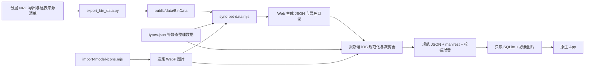
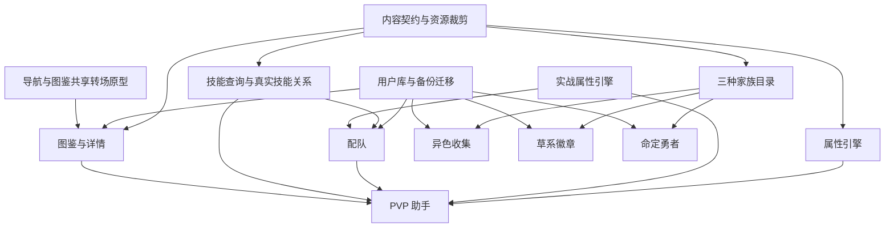

# rocom 原生 iOS App 实施规划

> 调研日期：2026-10-02（Asia/Shanghai）。代码基线：`a1b39c7ea22ccf5b8d35f5e73bb70f7fe47dc428`。本文是实施交接文档；初始调研仅新增本文，后续P0实施见第15节。仅支持iOS27，已迁移正式Xcode27/Swift6.4与deployment27.0。**当前 P0 architecture accepted / frozen，见15.6**；15.4/15.5为历史暂停与回归记录。用户将另开任务进入P1，本轮仅收尾。

## 1. 目标、决策与实施边界

使用 Swift + SwiftUI 重新设计原生 iPhone App，保留 rocom 的数据语义和业务规则，不嵌入 WebView，不运行 JavaScript 业务引擎，不翻译 Vue 组件或 CSS。当前项目实际是 Vue 3 + Vite + TypeScript，并非 React。

首版八项功能：图鉴、属性克制、技能查询、配队、PVP 助手、异色收集、草系徽章、命定勇者。建议采用以下实施默认值；它们是本规划的设计选择，并非已经实现的能力：

- 最低 iOS 27，不支持iOS18–26，不为旧系统编写availability fallback。当前主要供用户个人使用，目标iPhone已运行iOS27（用户确认）；开发/验收使用正式iOS27 SDK、iOS27 Simulator及该真机。iOS18 runtime运行已从P0要求中删除。
- Swift 6 语言模式；实测Xcode27.0(27A266a)、Swift6.4、iOS/Simulator SDK27.0及runtime27.0(24A434)，developer目录为`/Applications/Xcode_27.app/Contents/Developer`。不依赖beta API或未经实际SDK确认的语法。
- 离线优先：首次安装内置完整首版裁剪数据与必要图片；没有网络也能使用八项功能。
- 游戏目录：构建期规范化 JSON 为权威发布中间格式，生成只读 SQLite 供正式 App 查询；用户数据单独用 SwiftData；少量界面偏好用 UserDefaults。
- 不接账户、CloudKit、在线对战或 AI 服务。PVP 规则问答是本地确定性解析，不是大模型。
- 先通过图鉴共享转场技术验收，再扩展全量页面；不能把普通 push 当作核心动画的交付结果。
- 所有生成输出写入独立 iOS 产物目录。基础游戏数据仍由现有同步链维护，个人记录永远不回写 `public/data`。

### 1.1 首版功能边界

| 功能 | 首版必须交付 | 不因 Web 现有能力而自动扩张的范围 |
| --- | --- | --- |
| 图鉴 | Grid、搜索、多条件筛选、排序；详情六维、特性、技能池/技能石/血脉、进化、已有栖息/捕获/培育资料；图片共享转场及反向返回 | 不做星图、独立高级表格、配种模拟、孵蛋反查；雷达图可改成更易读的原生条形统计 |
| 属性克制 | 单属性四象限关系、双属性承伤、两属性打击覆盖、具体倍率与文字解释 | 不复刻 ECharts 力导向大图 |
| 技能查询 | 名称/描述/编号/属性/类别检索；技能详情；技能来源和精灵反查；默认最终形态及全部形态切换 | 不用名称合并后的显示 ID 替代战斗真实技能 ID |
| 配队 | 多队伍、6 槽、性格/个体/血脉/4 技能、血脉魔法、草稿保存/放弃、交换槽位、推荐技能、导入导出 | 图片 OCR 导入作为后续可选子任务；首版仍提供 JSON/旧分享链接导入 |
| PVP | 双方选择、临时构筑、六维/速度、克制、联防、双向伤害、一击威力线、现有特例、资料与文字规则问答 | 不扩展完整战斗模拟、胜率、环境队伍排行；独立语音识别按钮可后续增加，首版可用系统键盘听写 |
| 异色收集 | 赛季、家族和独立收藏槽位；搜索、筛选、点亮/取消、撤销、统计与迁移 | 不按每个进化阶段重复计数，不自动同步游戏内状态 |
| 草系徽章 | 家族奖牌；3 地点足迹的未记录/已点亮/未点亮状态、搜索、统计 | 不创造其他七类徽章规则，不把家族目录限制成草属性 |
| 命定勇者 | 初始祖先家族奖牌、获得/未获得筛选、统计；与草系记录隔离 | 不从草系奖牌自动推导获得状态 |

详情页已有图鉴收集和课题打卡，首版保留在图鉴详情内（属于图鉴功能，不新增第九个顶级入口）。设置中的备份、主题、数据版本属于支撑能力。若后续明确缩减课题 UI，仍须无损保留导入备份中的 `handbookProgress`。

## 2. 调研方法与已验证基线

检查了路由、首页/侧栏、八项页面及关联详情、共享组件、`src/lib`、feature 模块、数据生成/导出/图片导入脚本、Vite 发布过滤、PWA 缓存、用户备份和现有测试。重点逐段检查 `pvp-lite.vue` 的 script、规则入口和 UI 参数。本文用文件路径和函数名定位；后续行号变化时应按函数名检索。没有运行 iOS UI 或验证真机动画，本文动画方案仍需原型验收。

### 2.1 当前数据规模

以下是本机快照的原文件字节数/条目数，不是 iOS 包体预测，也不是部署站点下载体积：

| 项目 | 结果 |
| --- | --- |
| `public` / `public/data` / `public/assets` | `du -sh` 约 423 MB / 351 MB / 72 MB |
| `NRC` / `NRC_S3_backup` | 约 518 MB / 920 MB；都不进入 iOS 产物 |
| `public/data/BinData` | 763 文件，294,432,470 字节 |
| `public/data/tables` | 12 文件，6,838,715 字节 |
| `Pets.json` | 1,147 配置，631 标记已实装，208 配置标记首领；2,195,533 字节 |
| `pets/*.json` | 1,147 文件，42,136,146 字节；重复嵌入技能、属性和进化信息 |
| 真实图鉴编号集合 | `src/lib/generated/handbookIds.json`：468 个；不能把全部 `species_id` 都当成真实图鉴编号 |
| `PetSkillIndex.json` | 1,120,100 字节，`skills` 639 条 |
| `SkillAcquisitionIndex.json` | 613 个 canonical 技能组，3,710,461 字节 |
| `moves.json` / `bloodline_index.json` | 475 条旧整理技能 / 1,147 条血脉索引；244,854 / 5,530,830 字节 |
| `types` / `personalities` / `magic_items` | 19 / 30 / 5 条；属性含 ID 19 首领，常规战斗属性为 18 种 |
| `items.json` | 4,436 条，2,149,064 字节；仅裁剪详情需要引用的道具 |
| `friends` / `items` WebP 目录 | 824 / 2,236 文件，57,528,034 / 12,045,892 字节 |
| 异色目录 | 81 收藏槽；S0=2、S1=20、S2=19、S3=21、S4=19 |
| 徽章初始祖先家族 | 当前算法得到 192 个；不是草系专属家族数 |

### 2.2 本次验证结果

| 命令 | 结果 |
| --- | --- |
| `yarn type-check` | 通过 |
| `yarn build` | 通过；已有 OpenCV 的 fs/path/crypto 浏览器 externalization 警告及大 chunk 警告，OCR/WASM 等不迁入 iOS |
| `node scripts/test-pet-data-quality.mjs` | 通过：1,147 记录、631 已实装 |
| `node scripts/test-skill-acquisition-index.mjs` | 通过：613 canonical 技能 |
| `node scripts/test-shiny-collection.mjs` | 通过：81 槽，覆盖状态、取消合并、旧存储/备份迁移、失败恢复 |
| `node scripts/test-handbook-progress.mjs` | 通过 |
| `node scripts/test-badge-trial-data.mjs` | **失败，既存资源缺口**：3784 云梦豚、3785 长江豚缺头像；家族 `species:467` 同时受影响 |

缺失文件为 `public/assets/webp/friends/img_Wat_ZhuZhuTun1_001_Res.webp` 和 `img_Wat_ZhuZhuTun2_001_Res.webp`。本次没有修补。全体配置包含大量内部/未实装图片引用，不能用“全体引用都存在”作为首版裁剪的默认标准；必须对最终纳入范围分别出缺失报告。

未执行 `yarn sync:pet-data` 或导出/导入资源命令，因为它们会改写生成数据。本次构建只产生被忽略的构建产物，没有 tracked 业务变更。

## 3. 八项功能的真实入口、页面和组件

共同入口：`src/router/index.ts` 使用 `vue-router/auto-routes`；`src/pages/index.vue` 渲染 `src/features/my-home/MyHomeDashboard.vue`；`src/components/Sidebar.vue` 提供侧栏。首页有图鉴、属性、技能、PVP 研究入口及配队入口；收藏工具区有徽章、命定勇者、异色。不要把 Web 首页视觉或侧栏布局作为 iOS 约束。

| 功能/路由 | 主要实现文件 | 组件/逻辑连接 |
| --- | --- | --- |
| 图鉴 `/encyclopedia` | `src/pages/encyclopedia.vue` | `FriendPortrait.vue`、`petHandbook.ts`、`bloodline.ts`、`petImplementation.ts`、`petVisibility.ts`、`petPresentation.ts`、`petDetailPrefetch.ts`、`petSharedTransition.ts` |
| 精灵详情 `/pets/:id` | `src/pages/pets/[id].vue` | `FriendPortrait.vue`、`SkillIcon.vue`、`TypeBadge.vue`、ECharts Radar、`handbookProgress/*`、`petSharedTransition.ts` |
| 属性 `/attributes` | `src/pages/attributes.vue` | `features/battle-query/{TypeRelationCards,DualDefenseMatchupCards,DualOffensiveCoverageCards}.vue`、`typeDefenseMatchup.ts`、`typeIcons.ts`、ECharts Graph |
| 技能 `/skills`、`/skills/:id` | `src/pages/skills.vue`、`src/pages/skills/[id].vue` | `features/skills/{SkillResultCard,SkillPetResultCard}.vue`、`skillAdapter.ts`、`petEvolutionFamilies.ts` |
| 配队 `/team` | `src/pages/team.vue` | `features/team-builder/{TeamToolbar,TeamSlotCard,TeamPetEditor}.vue`、`types.ts`、`leaderBloodline.ts`、`teamStorage.ts`、`statCalculator.ts`；附带 `features/team-image-import/*` |
| PVP `/pvp-lite` | `src/pages/pvp-lite.vue`（约 4,741 行） | `statCalculator.ts`、`damageCalculator.ts`、`teamAnalysis.ts` 的属性函数、`meteorBugCaptureBall.ts`、`teamStorage.ts` |
| 异色 `/shiny-collection?season=4` | `src/pages/shiny-collection.vue` | `features/shiny-collection/{catalog,storage}.ts`、`generated/catalog.json`、`FriendPortrait.vue`、`TypeIcon.vue` |
| 草系 `/badge-trials` | `src/pages/badge-trials.vue`（Web 标题仍是“八大徽章”） | `lib/badgeTrials/{catalog,storage,types,index}.ts`；当前实际编辑 `grass` |
| 命定勇者 `/destined-hero-badge` | `src/pages/destined-hero-badge.vue` | 同一徽章目录与存储；独立 trial key `destined-hero` |
| 支撑 `/data-management` | `src/pages/data-management.vue`、`src/lib/userDataBackup.ts` | 全量备份/替换/合并；不得忽略这条迁移通路 |

### 3.1 图鉴与详情业务

- 列表读取 `Pets.json`、`bloodline_index.json`。默认 `implemented`；筛选支持主/副属性任意位置匹配且条件相交、攻击倾向、首领/首领潜力/初始/已进化/可进化。排序为编号、总种族值降序、速度降序、中文名；同值按配置 ID。
- `petHandbook.ts`：配置 `id` 与图鉴 `species_id` 必须分开。全角数字转半角，图鉴补三位；数字搜索包含去前导零、前缀和补零编号后缀匹配，不能简单改成 Int 相等。非数字支持中文名、资源名、形态、属性、默认血脉等。真实编号必须属于生成的 handbook ID 集合，否则显示“配置 ID”。
- `petVisibility.ts` 当前排除 3777 幽影树内部形态。不是删除整个底层配置：旧备份和引用仍需可识别。
- `petPresentation.ts` 只折叠重复首领配置：键为 `species_id + 中文名 + 资源名`；优先已实装、六维和非零、较小配置 ID。普通/地区形态不按 species 粗暴折叠。
- `isPetImplemented` 优先显式布尔，老数据才回退 egg groups；生成阶段判定更复杂，不能在 iOS 简化成“有头像/可培育就是已实装”。
- 详情主要读取 `pets/{id}.json`，另需 `Pets/types/moves/items`、`tables/PET_HANDBOOK.json`、课题奖励/技能名文件。`getFriendDetail`、技能 `filterMoves`、`moveCoverageTypes`、`strongestMoves`、`evolutionStages`、`catchGuarantByBall`、`getPetTopics` 是拆解入口。
- 保留种族值与实战值的清晰区别；详情技能按技能池、技能石、血脉展示，展示来源不能等同当前已装备。进化树保留分支和条件。
- 捕获资料已有简化规则：保底率 `r>=10000` 为 1 次，普通球约 `ceil(10000/(r*1.2))`，高级/属性球约 `ceil(10000/(r*2))`；低于等于 0 或缺失不能当作 0 次。它是当前工具口径，不是实时概率模拟。属性球映射和阈值说明从详情页提取成共享常量/fixture。
- 详情课题现在存在按名称归一化查表的路径；iOS 生成期建立显式 `speciesId -> topic IDs`，并对照现有结果验证，避免运行时再次靠中文名称连接。
- Web 已有 View Transitions API，仅在详情预取成功等条件下由 Grid 启动；没有提供完整原生式返回保证。其 DOM 逻辑和固定时长不迁移。

### 3.2 属性与技能查询业务

属性关系来自 `types.json` 的 `vulnerable_to/resistant_to`，不是 `TYPE_DICTIONARY`。`/data/type_dictionary.json` 在源码 public 根目录不存在：`vite.config.ts` 的 `filter-deployment-data` 开发中间件和构建复制，将 `public/data/BinData/TYPE_DICTIONARY.json` 暴露为该 URL。属性页用它补名字匹配和配色，原生语义色方案可省去这份完整表。

`typeDefenseMatchup.ts`：单属性承伤 2/1/0.5；双属性先去重、最多两种，乘积 4 映射为 **3**，其余保留 2/1/0.5/0.25。攻击覆盖是两个攻击属性可克制目标的集合并集，不能将两个攻击倍率相乘。排除 Leader；污染图标不是第 19 个常规战斗属性。

技能查询要同时理解两套 ID：

1. `moves.json` 是历史整理数据；`PetSkillIndex.json.skills` 是当前同步生成目录，不可只裁剪前者。
2. `skillAdapter.ts/buildSkillSearchItems` 按去空格、大小写规范化后的技能名分组；显示 ID 优先历史 move，目录覆盖描述、类别、威力、能耗、类型等字段；保留全部 alias IDs。可能合并同名不同变体，这是风险而不是新战斗引擎的 ID 设计。
3. `SkillAcquisitionIndex.json` 包含 `skill_id/skill_name/alias_ids/pet_ids/sources_by_pet`，来源枚举为 `pool/stone/bloodline`。只用 `PetSkillIndex.entries` 会漏血脉来源。
4. `petEvolutionFamilies.ts/buildPetSkillFamilies` 以最终进化的 species 为键；分支终点分别成家；默认不含首领；沿进化链汇总可获得成员和来源。详情默认已实装、最终形态；切换 all 才展示逐配置（含首领）。不得声称“祖先会该技能”等于终点直接可装备该技能。
5. 列表可学习数量应与反查默认家族结果一致。`skills.vue/loadSkillIconMap` 还按缺图标技能找相关精灵详情补图标；这应前移到生成期，不能让 iOS 搜索为补图标批量读取全部详情。

### 3.3 配队业务

以当前 `team.vue` 为准，老 `FEATURE_MAP.md` 中部分“定位分析/威胁排行”不代表现页面仍调用。

- UI 最大 10 队、每队固定 6 个槽、每槽最多 4 个去重技能；至少保留 1 队。名称 trim 后 32 字符（Web 是 UTF-16 `slice`，Swift 字符计数不同，兼容测试需覆盖中文/emoji）。备份合并可能超过 10 队，导入不可为了 UI 上限静默截断。
- 槽字段：`friendId/personalityId/legacyTypeId/individualValues/moveIds/roles`；队级 `magicItemId`。`roles` 应保留，当前不必重做旧的自动角色推断。
- 选择器为已实装、公开且非首领配置；普通精灵通过血脉类型 19 表达首领血脉，要求 `leader_potential` 且详情实际有该血脉技能，见 `leaderBloodline.ts`。不能把 5xxx 首领直接作为配队默认候选。
- `TeamPetEditor.vue/filteredFriends` 按已使用次数、配置 ID 排序，显示前 80 项；当前未强制禁止同宠占多个槽。原生可以显示重复提醒，但不能擅自增加“全队宠物唯一”的规则。槽身份不能用 PetID 代替。
- 默认性格：Physical→6，Magic/Magical→11，其余→1。攻击倾向 Both/未知时预设选择较高基础攻击，平手偏物攻。
- 技能候选为池、石、**所选血脉**对应技能；相同 ID 后写覆盖来源。改变血脉需剔除已不合法技能；首次选宠/旧数据空技能会推荐，主动改血脉不应偷偷补满。
- 推荐分数 `getMoveRank`：固定威力否则 18；本系 +48、默认血脉属性 +18；与 Physical/Magic 倾向一致 +26，Both 的攻击技能 +14；Status +6，Defense +3。同分按能耗降序，再 ID 升序，取前 4。只是启发式，不是最优战术。
- 草稿只在保存后写入持久队伍。切换槽/队伍、关闭编辑、新建/复制/移除时保护未保存草稿。重排是**交换两个槽内容**，不是插入移动；未保存草稿时先解决草稿，重排后更新当前选中槽。
- `?team=` 是 JSON→UTF-8→Base64 的分享内容，只有单队字段，不等同整库备份；URL 层必须正确处理 `+ / =` 编码。旧字段缺失补六项 0。原生用系统文件/分享菜单承载，不依赖 Safari localStorage。
- `finalizeSlot` 在 Web 对找不到详情的槽可能清空；原生不得因读取失败清除用户构筑，保留 unresolved ID 并提示修复，这是明确的数据安全改进。

### 3.4 异色、草系和命定勇者

异色由 `scripts/build-shiny-catalog.mjs/buildShinyCatalog` 生成，`sync-pet-data.mjs` 调用：以 PETBASE 的 `have_shiny=1`、`belong_season`、`JL_shiny_res` 和 `PET_EVOLUTION_CONF` 为依据，纳入已实装 3xxx/5xxx，排除遭遇 Boss 4xxx 和 3777。完整进化路线构成一个独立槽；没有路线才按单宠槽。显示最高非首领阶段，保留全部阶段和首领成员供搜索/迁移。不能简单根据 `_yise` 文件名穷举或按图鉴行计数。

槽 ID 形如 `s4-f123-e456`（或 `p<petId>` 后缀）；进度键为 `s<season>:<slotId>`，例如 `s0:s0-f340-e313`。同家族不同进化路线、同形态不同赛季不可共用进度。目录中保留 `targetPetId/representativePetId/memberPetIds/members/familyId`。搜索任一成员应显示相关家族，状态筛选在槽位层进行。赛季名称当前在 `catalog.ts` 手工维护，需成为显式内容输入。

徽章 `buildBadgeTrialFamilies` 与技能家族完全不同：排除首领作为家族成员；遍历已实装一般配置向上找最低祖先，用 `species:<root.species_id>`；祖先查找可经过未实装普通配置，带环检测。代表优先已实装、default、小 ID；属性筛选按全家族属性并集。

草系地点硬编码于 `badgeTrials/types.ts`，不是从地图生成：`somia` 记忆中的索米亚草原 210，`stonehenge` 记忆中的巨石阵 317，`plata` 记忆中的普拉塔草原 199。分母总计 726；这是手动记录目标数，不代表程序知道每个地点的完整出没名单。

足迹 `buildBadgeTrialPetCatalog`：普通形态按 species+中文名+资源名+form 分组，首领按 species+中文名+资源名折叠；记录键为代表配置 `pet:<id>`，地区形态不能合并为 species。每地点独立记录 lit/unlit；未记录是第三态。旧数字 species 足迹 key 在页面 `migrateLegacyFootprintKeys` 转成首个普通代表 pet key；当前 Web 只迁移 footprints 分支，iOS 应对旧形状单列 fixture，不能盲改未知记录。

命定勇者复用家族目录但只修改 `trials['destined-hero'].familyMedals`，与 `trials.grass` 完全隔离。家族奖牌点灭当前是删键；足迹删除也是删键，均没有通用取消墓碑，这影响合并备份，详见第 5 节。

## 4. PVP 助手业务规格（移植的核心依据）

### 4.1 数据与会话模型

启动读取 `Pets/types/personalities/moves/PetSkillIndex`；双方详情按需读取 `pets/{id}.json`，通过 Map 去重并发请求，区分加载中、失败和真无数据。已实装/公开精灵并折叠重复首领，搜索名称、图鉴编号、属性；结果上限 8。PVP 手动候选包含首领，这与配队选择器不同。

`refreshSavedTeam` 从 `getActiveTeam/getSavedTeamBuildSlots` 读取当前激活队伍；该投影只有槽序、宠 ID、性格、个体值、技能 ID，**没有血脉类型、血脉魔法或角色规则**。现 Web 在 mount 时刷新，不是实时统一 store。iOS Tab 长驻时需订阅已提交队伍变化，同时保持当前 PVP 临时编辑不会反写队伍。

建议 `BattleSession` 明确保存：双方 PetID、构筑、HP 百分比、球类型、我方来源 TeamID/SlotID、攻击方向、所选 SkillID、效果选项、虫群两个计数、爆燃层数、选中防守属性、活动栏目及本次资料状态。不要将分散的 computed/watch 搬成相互触发的多个 `onChange`。

### 4.2 构筑与六维公式

`statCalculator.ts` 为当前权威面板公式：个体值按 JS `Math.round` 后限制 0…10；正常编辑最多 3 项 >0。归一化函数本身**不**限制非零项数量；导入必须另做验证并保留原件。

令 `b` 为种族值、`i` 为个体值、`n` 为性格修正（上升 +0.2、下降 -0.1、其余 0；上下同项则中性）：

```text
HP = round((round(1.7 × (b + 3i)) + 70) × (1+n)) + 100
其他 = round((round(1.1 × (b + 3i)) + 10) × (1+n)) + 50
```

必须保留每一次取整及运算顺序。不能先合并公式再 round。Swift 对非负有效输入可用明确的 nearest/away-from-zero 策略；含非法值的兼容归一化要定义 JS Number/round 对照，不能依赖 Int 截断或银行家舍入。显示百分比的一位小数也要单独验证。

| 构筑 | 个体值 | 性格 |
| --- | --- | --- |
| saved | 当前我方槽位的六项 | 性格表中正/负项映射为 +20%/-10%；缺失中性 |
| none | 全 0 | 中性 |
| maxAttack | HP、速度、偏好攻击各 10 | 偏好攻击↑、另一攻击↓ |
| maxSpeed | 同 maxAttack | 速度↑、另一攻击↓ |
| maxHp | HP、物防、魔防各 10 | HP↑、另一攻击↓ |
| custom | 当前 UI 以 0/10 切换，最多三项；保留从 saved 带来的中间值 | 用户选上升项，自动下降非偏好攻击；若上升就是该项，则下降偏好攻击 |

偏好优先 `Physical/Magic/Magical`；否则比较基础双攻，平手选物攻。对方无 saved；没有关联槽位的我方 saved 回退 none。手动选陨星虫 3400 默认 maxSpeed，其余 none；选队伍则 saved。构筑 Sheet 使用草稿，应用才更新 BattleSession，取消无副作用。

### 4.3 速度与属性克制

- 速度比较使用完整实战速度，不是基础速度。对方另显示四档：i10/+20%、i10/0、i0/0、i0/-10%。同速只显示相同，不推断行动随机顺序、先制、技能优先级。
- `meteorBugCaptureBall.ts` 仅对 3400 陨星虫生效：`round(panelSpeed × (1+speedPercent)) + flatSpeed`。默认绝缘 +50；普通/高级/国王 +5%/+10%/+15%；其他球的本函数速度修正为 0。
- 球选项描述有双攻、防御、状态、连击等文字，但**这些没有统一参与伤害/对手面板**。尤其淘沙球描述减对手速度，不会在当前公式自动减对方速度。不要把展示文字误当已实现效果。
- `teamAnalysis.ts/getTypeRelationNet`：对防守方各属性，vulnerable +1、resistant -1，缺项 0；`getTypeMultiplier` 映射 net≥2→3、1→2、0→1、-1→0.5、其余→0.25。没有免疫 0x 分支。常规双属性重度弱点是 3x，不是其他游戏常见的 4x。
- 克制卡片只展示双方本系攻击对对方倍率。顶部 `best*Multiplier` 当前 `Math.max(1, …)` 会把全部受抵抗的 0.5x/0.25x 摘要抬成 1x；问答却取真实最大值。将此记录为差异 PVP-D1，不能悄悄混用。

### 4.4 联防的两种不同算法

1. 面板 `resistanceCandidates`：选择对方某一个本系，计算当前队伍每槽承伤，只保留 0.25/0.5；按倍率升序、槽序升序。**可能包含当前上场槽**。
2. 问答 `getSwitchRecommendationAnswer`：排除当前选中我方槽；看对方全部本系，对每候选取最坏倍率和倍率和；按最坏、总和、槽序升序。即使没有抗性仍返回相对最优者并说明无明确抗性。手动选我方而没有槽来源时不会排除同 pet 的队伍项。

两个接口分别命名为 `resistances(to:)` 和 `switchCandidates(against:)`，不要合成同一个未说明的“推荐”。它们都未考虑对手非本系覆盖、技能效果、生命、换人伤害或胜率。

### 4.5 技能解析与候选

`getDamageMoveById` 优先所选精灵详情中的池→石→血脉，再旧 `moveMap`，最后 alias map。alias 构建先匹配“规范名+类别+属性”，失败才按名称。`damageAttackerDetailMoves/getLearnableDamageMoves` 合并详情所有池/石/血脉并按原始 ID 去重。

- 我攻对方先展示队伍已装备可计算技能；反向无已装备技能列表。
- 建议列表按固定威力降序、ID 升序取 6，搜索只在当前攻击者候选中取 8；不是全技能数据库任意选招。
- 候选包含所有血脉，不受当前所选血脉限制，因此“可学习”不代表“当前构筑已合法装备”。iOS 文案必须区分；不要偷偷删掉此查询能力。
- `isDamageCalculableMove` 只检查类别物理/魔法、数值威力 >0、存在固定属性。状态、防御、无威力、无固定属性不可计算；**没有通用动态效果识别器**。带特殊效果但有数值威力的技能仍可能按基础威力估算。

### 4.6 纸面伤害精确公式

以 `damageCalculator.ts/calculatePaperDamage` 为依据，不要移植 `teamAnalysis.ts/calculateDamageEstimate` 旧公式（当前页面没有调用）。物理取物攻/物防，魔法取魔攻/魔防；防御和最大 HP 至少 1。本系由攻击者主/副属性 ID 与技能属性匹配，本系系数 1.25。默认等级 60，level 参数只影响伤害系数，面板公式仍是上述固定口径。

```text
effectivePower = max(0, basePower + flatBonus) × (1 + powerBoostPercent/100)
displayPower = round(effectivePower × STAB × typeMultiplier
                     × attackDefenseStageMultiplier × otherPowerMultiplier)
levelCoefficient = (level × 45/100 + 10) / 41       // L60 = 37/41
rawDamage = floor(round(attackStat × displayPower × levelCoefficient) / defenseStat)
finalMultiplier = 显式有效 finalDamageMultiplier，或 1 + damageBoostPercent/100
reduction = max(0, 1 - damageReductionPercent/100)
singleHit = max(2, floor(rawDamage × finalMultiplier × reduction))
hits = max(1, round(hitCount))
total = singleHit × hits
damagePercent = total / defenderMaxHP × 100，显示一位小数
estimatedHitsToKo = ceil(defenderMaxHP / total)
```

当前页面传 powerBonus、powerBoostPercent、hitCount、attackDefenseStageMultiplier；其余库级输入保留默认。输入 sanitizer 对非正乘数回退 1，减伤即便 100% 最终仍有最低伤害 2：这是当前计算语义，不是已验证的游戏结论。

固定校验例（源代码注释也列出）：攻击 234、防御 226、effectivePower 142.5、本系 1.25、属性 2、L60 → displayPower=356、单次伤害=332。原生计算层必须能解释中间项，页面不只给一个最终数字。

### 4.7 已实现特殊效果

| 特例 | 当前代码语义 | 原生实现要求 |
| --- | --- | --- |
| 选择型技能 | 描述去零宽空格；匹配“选择：”，按“或”拆，至少两项时只取前两项；下注标签为明/暗 | 生成期解析成结构化效果，保留 raw description、解析版本、适用假设 |
| 即时威力 | 匹配 `威力+N` 与 `威力+N%`；含“永久”整项忽略 | 不把永久叠层自动计入；未知语法标为未支持 |
| HP 条件 | “自己生命低于/小于/高于/大于 N%”，严格 < 或 >，取当前攻击者 HP 百分比 | 49/50/51% 边界测试，反向必须用对方 HP |
| 其他条件 | 描述有若/时/应对/位于/携带时，当前只是提示“按条件已满足估算” | 条件假设要出现在结果上下文，不能伪装自动判断 |
| 虫群 | 按规范化技能名识别；威力献祭 `+20×count`，连击 `1+count`；两个计数分别 0…20 | 保留独立计数，切换技能归零；后续用确证 ID 清单替代名称触发 |
| 烈火战神 5017 爆燃 | 按攻击者 ID；层数≥0、每次 ±3、无上限；乘数 `1+stage/10` 放进 displayPower 的攻防乘区 | 不直接改变面板攻击再重复加成；手工控制，不模拟叠层时机 |
| 陨星虫捕获球 | 仅上述速度修正 | 不扩展成所有球效果模拟 |

这些规则以应用代码为基准，没有独立验证游戏服务器公式。生成静态效果白名单可以减少 Swift 正则差异，但计算公式和参数状态仍用 Swift 重写。

### 4.8 一击威力线、HP 与问答

`calculateMinimumOneHitPower`：目标 HP 为 `ceil(maxHP×targetPercent/100)`，百分比限制 0…100；0% 直接返回 0。默认最大威力 5000，若上界仍不够返回 nil，否则二分找最低正整数威力。每次候选调用同一伤害引擎，不用反解近似公式。

`createOneHitPowerLines`：按攻击倾向选物理/魔法；本系分别算后选最低需要威力，同值偏高克制倍率；非本系选一个不属本系且对目标为 1x 的属性。它是**假想基础技能威力线**，不保证该宠能学到，也不套入当前虫群/爆燃/选择效果。无匹配属性或超过上界需显示不可得。

普通伤害百分比/预计次数以及 `getSelectedMoveOneHitAnswer` 仍按**最大 HP**，只有威力线用剩余 HP。这是语义区别，不能把“打掉最大生命 60%”误说成“对当前 50% HP 不能击倒”。原生首版默认分开显示“占最大生命”“按当前剩余 HP 是否击倒”，后者为显式改进 PVP-D3，并记录与 Web 问答的差异。

问答解析顺序：速度比较 → 高级意图 → 指定技能伤害 → 属性/种族值查询 → 不支持提示。高级意图含我方克制、对方最强本系、所选技能一击、换人、对方极限速度、我方最高伤害技能。指定技能在当前精灵详情中先精确名后包含匹配。问答会改变方向和所选技能，不是只返回文本。最高伤害先比已装备，否则比可学习；按首个选择效果，**不包含虫群献祭的当前计数**。语音使用浏览器 `SpeechRecognition/webkitSpeechRecognition`，不迁移 Web API。

Swift 实现应拆成 `BattleQuestionParser -> enum Intent -> BattleQueryService -> Answer + optional SessionAction`；UI 原子应用动作。先快照双方和数据版本，异步详情回来后校验请求身份，避免用户换宠后旧答案覆盖。首版保留文字输入和常用问题按钮，未知意图明确说明能力边界。

### 4.9 状态转换与必须决策的已知差异

- 换攻击方向/双方 ID：清除当前技能、效果、搜索、爆燃；确保双方详情；配置技能可用时选首个。换技能归零虫群计数并选择首项即时效果。
- 手动换宠重置对应 HP=100、自定义、球；清空全部恢复双方未选择及属性栏目。
- `swapSides` 交换宠、HP、球和临时构筑，清除我方槽来源。**现代码将 saved 预设转换为 none，却只把构筑值复制到未激活的 custom 中，可能丢失交换后的有效属性。**

迁移不是照搬疑似错误。P0 阶段建立 `rulesVersion` 和差异清单，建议以下明确结果；正式开发以 fixture 记录旧/新输出：

| 编号 | 旧行为 | 建议首版行为 |
| --- | --- | --- |
| PVP-D1 | 顶部最大克制至少 1x | 使用真实最大倍率，与逐属性卡片/问答一致 |
| PVP-D2 | saved 换边后落为 none | 将完整有效 nature（含 downStat）与个体复制为临时 explicit profile；交换两次恢复数值，不丢构筑 |
| PVP-D3 | 当前 HP 与满血一击语义混杂 | 保留最大 HP 伤害占比；新增明确的 currentHP KO 结果，不改伤害本身 |
| PVP-D4 | 推荐问答按默认效果，选择后 watcher 可重置层数 | 用同一计算快照和明确“默认效果”上下文驱动结果与选择，页面显示必须与答案一致 |

若还未批准规则差异进入版本，则标记兼容输出和限制，不可自行发明游戏规则。以上四项属于产品语义/状态一致性修正，不是证明游戏机制变化。

## 5. 浏览器存储、状态与原生迁移

### 5.1 实际存储清单

| 当前存储 | 内容/文件 | 原生归属 |
| --- | --- | --- |
| `rocom.team-builder.v2` | `teamStorage.ts`；`version:2, activeTeamId, teams[]`；team 含稳定字符串 ID、名称、时间戳、magicItemId、slots | SwiftData Team/Slot + 备份 DTO；保留原有字符串 ID，不强制解析成 UUID |
| `rocom.team-builder.v1` | 首次读取自动迁为默认队伍，旧 key 保留 | 导入器支持旧单队 DTO，不在 App 中假装能读到 Safari 存储 |
| `rocom_handbook_progress` | `handbookProgress/*`，v1；collected 按 species、topics 按 species/topic、ISO 日期 | SwiftData ProgressRecord；详情内读写 |
| `rocom.badge-trials.v1` | `badgeTrials/storage.ts`；trials→familyMedals/footprints/unlitFootprints | SwiftData ProgressRecord，key 包含 trial/location/entity |
| `rocom.shiny-collection.v2` | `features/shiny-collection/storage.ts`；v2 entries，显式 collected Bool + updatedAt | SwiftData ProgressRecord；必须保留 false 墓碑 |
| `rocom.shiny-collection.v1` | 按 `s季:petId` 的旧阶段记录 | 通过当前目录 members 展开到对应同季槽；没有映射的旧记录归档，不能无声消失 |
| `rocom.theme.v1` | `theme.ts`；light/dark | UserDefaults；原生新增 system 默认选项，兼容导入明确 light/dark |
| sessionStorage | `data-management.vue` 导入后刷新提示 | 瞬时状态，不迁移 |
| 历史 cookie | `handbookProgress/migration.ts` 的 `rocom_pet_topics_` 前缀 | 用户先在 Web 完成旧 cookie 迁移并导出；原生不访问 Web cookie |
| CacheStorage | `public/sw.js`：app shell、core data、pet details（120）、images（180）、static（80）等 | 不迁移缓存；原生资源包/图片缓存独立管理 |

源码未发现应用直接使用 IndexedDB；OCR 第三方依赖可能有其内部缓存，不能据此称全浏览器从未使用 IndexedDB。`src/main.ts` 没有 Pinia 安装，实际是 Vue ref/reactive/computed、composable 共享引用和 localStorage；`auto-imports.d.ts` 里出现 Pinia 声明不等于启用了 store。

### 5.2 备份兼容契约

当前真实格式是 `format:'rocom-user-data', version:4`，内含 teams v2、handbook v1、badge v1、shiny v2 和 theme。`userDataBackup.ts` 接受 v1/v2/v3/v4：v1 补空 badge，v1/v2 补空 shiny，v3 的旧 shiny 由解析器迁移。`docs/USER_DATA.md` 仍写全量 v3、异色 v1，已过时。

已有合并语义应制作真实输入输出样本：

- 队伍按 team.id、更新较晚的整队覆盖；相同时间保留当前；新增 ID 合并；保留当前激活队伍。没有队伍删除墓碑，旧备份可恢复已删队伍。
- 图鉴 collected/topic 和徽章 familyMedals 按较新完成时间取并集；取消是删键，无法表达比旧备份更新的取消，可能被重新点亮。
- 足迹 lit/unlit 分别按时间并集，交叉冲突较新胜；同时间 **lit 胜**。删除足迹不是 unlit，删除没有墓碑。
- 异色 newer 操作胜，同时间 **false 胜**；`setShinyCollected` 时间至少上次+1ms；只统计当前目录中有效 key。撤销也是一次新操作，不回写旧时间。
- 替换用备份全部内容；旧版缺失部分变为空；合并旧版则保留现有新增部分。Web 有顺序写入加补偿回滚，但不是数据库事务。

原生导入流程：系统 `fileImporter`/分享入口 → 大小与结构检查（建议上限 10 MB，超限明确提示）→ decode 到独立 DTO → 版本迁移 → ID/数值/时间/重复键检查 → 展示队伍与进度数量及 unresolved 条目 → 用户选择合并/替换 → 事务写入 → 成功后一次发布状态。任何失败保持原数据库不变。替换前导出恢复快照；不因坏数据创建空库覆盖旧库。导入系统文件时遵守 security-scoped URL 生命周期。

首版同时提供：

1. Web 兼容 v4 导入/导出，用于可表示数据双向交换；system 主题导出为当前 light/dark，并说明兼容映射。
2. 原生完整备份（独立 format，例如 `rocom-ios-user-data` v1），保存统一状态墓碑、来源版本、未映射数据、原生设置。

原生 ProgressRecord 建议支持 collected/uncollected、lit/unlit/unrecorded 及 updatedAt/deletedAt，避免未来取消丢失；但 Web v4 无法表示全部墓碑，导出兼容备份必须说明该限制，不宣称可实现无损多端自动同步。未知但格式有效的旧 ID 保留为 unresolved 记录，导出仍保留；损坏记录给诊断报告，不能静默丢弃。

## 6. 数据和资源的来源与裁剪契约

### 6.1 当前源链



`scripts/export_bin_data.py` 和 `scripts/export_pet_json.py` 是原始导出相关脚本。已有 `yarn export:bin-data` / `yarn import:fmodel-icons` / `yarn sync:pet-data`。更新参考 `docs/SEASON_DATA_UPDATE.md`、`S4_UPDATE_LESSONS.md`、`S4_DATA_UPDATE_AUDIT.md` 和 `scripts/bin-data-sources.example.json`。S4 曾出现 schema/localization 不同层混用、嵌套结构引用误解析、固定图鉴上限失效；解析成功不代表语义正确。

同步器目前读取 PETBASE、PET_HANDBOOK、PET_EVOLUTION、LEVEL_SKILL、SKILL、PET_BLOOD、PET_CLASSIS、PET_EGG、PET_RANDOM_EGG、PET_NAME_MAP、BAG_ITEM、MEGAMAP_GATHERING、MONSTER、MONSTER_CATCH、REWARD、VISUAL_ITEM、EXCHANGE、ITEM_LABLE_TYPE 等表，以及 `types.json`。**这些是生成输入，不是 iOS 全量运行时依赖**。不要为了首版删改现有同步器读取列表，先在其输出后加 exporter。

`types.json`、`moves.json`、`personalities.json`、`magic_items.json` 当前不是这个同步器生成的文件，属于需明确 hash/来源的静态整理输入。原始游戏属性枚举与规范 ID 不一致，`RAW_TYPE_TO_NORMALIZED_ID` 还将两个原始类型合并到 Ground；iOS 使用规范 ID，不再自行重映射。已有 `PET_LEGACY_MOVE_OVERRIDES` 等校正应随生成规则统一复用。

### 6.2 字段白名单与功能矩阵

下列拟产物在本次调研中**尚未生成**。JSON 字段应采用稳定 lowerCamelCase，保留 source ID，nullable 明确。表中的“派生”均需源路径、版本及对照样本。

| 拟规范数据 | 来自 | 必留字段/关系 | 消费功能 |
| --- | --- | --- | --- |
| `pets.json` | Pets + details | petId、可空 handbookId、speciesId、中文名/检索别名、form、type IDs、默认血脉、首领潜力/形态、implemented、publicVisible、attackStyle、六维、parentPetId、portraitAssetID | 全部 |
| `pet-details.json` | details | petId、traitId、worldProfile 的已显示文本、catchInfo、精简培育资料、技能关系、进化条件引用 | 图鉴、配队、PVP |
| `types.json` | types | typeId、英文稳定名、中文名、weak/resist IDs；normalBattleType 标志 | 属性、图鉴、配队、PVP、技能 |
| `skills.json` | details + PetSkillIndex.skills | **真实 skillId**、中文名、类别、可空 typeId/power/cost、description、iconAssetID | 技能、详情、配队、PVP |
| `skill-groups.json` | skillAdapter + acquisition index | groupId、展示 canonical/legacy ID、aliasIds、展示字段、名称排序键；保留同名冲突报告 | 技能检索/反查 |
| `pet-skills.json` | details + acquisition | petId、skillId、source(pool/stone/bloodline)、可空 legacyTypeId、源顺序 | 技能反查、配队合法性、PVP |
| `traits.json` | details.trait | traitId、名字、说明、图标 | 图鉴、PVP 资料；不是通用执行脚本 |
| `evolutions.json` | details.evolution_tree + PET_EVOLUTION 必要字段 | edgeID、from/to PetID、分支/阶段、等级、道具/特殊条件文本、sourceEvolutionID | 图鉴；家族生成 |
| `families.json` | 两种现有家族函数 | badgeRootFamily 与 skillTerminalFamily **分别命名**、代表、成员、属性并集、显示顺序 | 技能、徽章、命定勇者 |
| `personalities.json` | personalities | id、名字、六项修正、上升/下降统计验证 | 配队、PVP |
| `magic-items.json` | magic_items | id、名字、说明 | 配队；暂不影响伤害 |
| `shiny-slots.json` | 已生成异色目录 + catalog.ts | 完整槽 ID/赛季/家族/代表/目标/成员/图片关联、赛季标签 | 异色及旧进度迁移 |
| `badge-catalog.json` | badge catalog/types | 家族键、足迹键/代表配置、地区/首领、stageDepth、地点 id/name/目标数 | 草系、命定勇者 |
| `handbook-topics.json` | PET_HANDBOOK 镜像、topicText、rewards、topic-skill-names | handbookId、topicId、最终可读要求、数量、奖励引用；保留必要参数以便排错 | 图鉴详情 |
| `items-subset.json` | items + 进化/奖励引用 | id、名、说明、quality、iconAssetID；不带全量炼金 recipes/所有关联宠 | 图鉴详情小型道具 Sheet |
| `battle-effects.json` | PVP 特例/描述解析的显式白名单 | real skillId/petId、规则 kind、参数、条件、支持程度、来源 | PVP |
| `assets.json` | 资源引用闭包 | assetID、语义用途、sourcePath/hash、outputPath/hash、像素尺寸、格式、缺失占位原因 | 全部图片组件 |

### 6.3 ID 和选择范围

必须使用区分语义的 Swift 包装类型（或等价明确命名），不能只传一堆 Int：PetID=配置、HandbookID=真实图鉴、SpeciesID=源字段、SkillID=真实招式、SkillGroupID=检索合并组、BadgeFamilyKey、ShinySlotID、TeamID、SlotID。尤其：

- family 的 `species:` 字符串在技能和徽章中语义不同，数据库必须包含 family kind。
- 收藏状态永远不按列表下标/名称/图片名作为主键；相同头像不等于相同实体。
- 精灵详情 JSON 不含顶层 species_id，需从 Pets 或 detail.species 连接，不凭 detail.id 当图鉴 ID。
- 技能原始配置、历史别名和名字组可一对多；保留冲突，默认禁止名称单独决定可装备身份。

裁剪根集合：公开图鉴配置（保留已/未实装筛选语义）、PVP 公开已实装候选、配队合法候选、81 个异色槽及全部迁移成员、徽章/足迹目录。再递归保留父/子进化关系、引用技能/特性、血脉、课题、奖励/进化道具。未显示的内部配置可只留 tombstone/别名映射供旧备份解析。上游现徽章目录没有调用 publicVisible 过滤（可能包含 3777 家族关系），先生成与现算法相同的目录，不把图鉴过滤无声套到所有功能。

静态图片只收录真正显示的代表/详情图，不因 metadata 闭包中某个祖先或迁移成员存在就复制全部图片。预计可显著小于原 public，但最终大小必须以 exporter 报告为准；不得写死图鉴数或赛季总数为永久不变。

### 6.4 图片与其他资源

- `FriendPortrait.vue` → `petPortrait.ts`：`JL_` 或 `img_` 开头保持，否则补 `JL_`，路径 `public/assets/webp/friends/<key>.webp`。大多数是头像，不能假设全部是透明全身立绘或拥有更高分辨率。
- 技能/特性 `icon_id` → `public/assets/webp/items/<icon_id>.webp`；奖励道具亦由独立 icon 字段映射。同目录混存不同用途，按引用选取，不复制目录。
- 上游图片来自 `NRC/Content/NewRoco/Modules/System/Common/Icon/Pet1024`、BattleUI `SkillIcon`、`FeatureIcon` 等。`import-fmodel-icons.mjs` 按完整源路径匹配并用 sharp 转 WebP，当前质量 85；本地 NRC 仅是导入来源。
- `src/assets/Species.png` + `typeIcons.ts` 是属性图集，512×256，步长 56×58；UI 内裁剪 `(col×56+3,row×58+2,52,54)`。iOS 生成期导出 18 个独立图标，污染只在未来确需时加入；不在运行时仿 DOM/canvas 裁剪。
- `src/assets/game-ui/*`、`design/game-ui-candidates`、首页背景、金框/发光纹理全部不纳入。导航/控制用 SF Symbols，游戏属性小图仅作为内容识别，不作为系统控件皮肤。不带 Web 字体、JS、WASM、OCR 模型、音视频、3D 资源。
- 建议裁剪输出透明 PNG（若源有 alpha）、不透明图可选 JPEG；Grid 约 256px、详情至多原始尺寸/768px 的两档，实际按显示尺寸×scale 校准。不为了数字达标放大原图；同源相同尺寸以 hash 去重。先验证锐度、alpha、色域及深色背景边缘，再定压缩参数。
- WebP 是否直接复用应以目标系统 ImageIO 真机解码/内存测试为证，不假设 SwiftUI `Image` 对文件扩展名自动支持；首版默认生成通用格式，避免引入图片库只为绕过格式问题。
- 图片缺失回退稳定中性占位，包含可读名字；正反向动画必须始终使用同一缓存图片/占位。关键已实装缺图需修复或在 manifest 中显式批准占位，不靠构建时偷偷忽略错误。

## 7. Web / iOS 共源生成与同步 pipeline

### 7.1 建议目录（后续实施时才创建）

```text
scripts/ios/
  export-content.mjs           # 从现有产物规范化、裁剪、解析关系
  build-database.mjs           # 规范 JSON -> 只读 SQLite，可调用系统 sqlite3
  build-assets.mjs             # 白名单资源转换；使用已有 sharp
  validate-content.mjs
  export-rule-fixtures.mjs
  content.schema.json
  asset-allowlist.json         # 必要的人工例外/占位记录
  content-overrides.json       # 有依据的、与基础数据分离的规范化补充
shared/fixtures/ios/           # TS 输入/结果与迁移样本，去除个人数据
build/ios-content/<version>/   # 可重建发布产物，后续加入 ignore
ios/                          # 原生工程，见第 9 节；本次不创建
```

新增命令建议命名 `yarn ios:content:export`、`yarn ios:content:validate`、`yarn ios:fixtures`，但现在 package.json 中没有它们。不要在仅规划阶段运行。生成逻辑先适配当前产物；待稳定后，把 Web/生成器重复的纯目录函数提取到共享构建模块并做结果等价验证。不得为了“共用”让 Swift App 加载 TS 引擎。

### 7.2 步骤及失败处理

1. **固定输入**：记录 commit、逐表数据 hash、静态整理数据 hash、脚本 hash、图标源清单；更新赛季时复核 BinConf/DataCompressed/Localize 兼容层，按现流程先 dry-run，再源导出。失败留错误报告与原因，不手工大改 JSON。
2. **统一生成 Web 消费层**：已有 `yarn sync:pet-data`，随后 pet quality、skill acquisition、shiny、badge 检查。iOS exporter 消费这一次生成的结果，不能一部分读旧 public、一部分直接读新 NRC。
3. **规范化**：扁平化重复技能/特性/属性，输出真实 ID 与显示组，结构化 PVP 特例、搜索字段、三种家族关系。未实装与 unknown 不转成 false/0 的含糊默认值。
4. **闭包与白名单**：从首版根集合计算依赖；每一条被删记录、被删字段有类别统计。检测未解析引用、ID 重复、环、孤立技能、同名 ID 冲突、无效类型、图鉴资格、跨季槽污染。
   同一真实 skillId/traitId 在不同详情出现不一致有效字段时，必须输出来源与冲突值并阻止静默 last-write-wins；明确生成优先级或保留上下文变体后才能发布。属性缺失、重复主副属性应作为内容诊断，不能借归一化掩盖两个现有属性算法的异常输入差异。
5. **生成资源清单**：仅消费 assets manifest 的源文件；缺图输出 pet/skill/feature 关联和路径；转换后检查文件实际尺寸/格式/alpha；不凭文件扩展名信任内容。
6. **生成 JSON/SQLite**：排序稳定，固定 schemaVersion/rulesVersion；SQLite integrity_check 与 foreign_key_check；JSON 与 DB 行数/抽样内容一致。数值规则 fixture 与产物分离，不能把产物值倒推为测试期望。
7. **差异报告**：相对上版列新增/删除/变更宠、技能、家族/异色 key、丢图、数据包字节数；尤其稳定 ID 消失必须给迁移表或 unresolved 策略。正常内容更新不能静默把用户进度归零。
8. **发布构件**：写 manifest、hash、校验报告；一次生成供 Web release 和 iOS release 引用同一个 source revision。CI 没有 NRC 时用已提交 BinData/生成层也可重建 iOS 包；NRC 解包是内容维护任务，不是每次 App 构建的前置。

manifest 最少包含：`schemaVersion/contentVersion/rulesVersion/sourceRevision/inputHashes/generatorVersion/minimumAppBuild/locale/defaultSeason/counts/files[]/assets[]/knownMissingAssets/idMigrations`；file 项含相对路径、bytes、SHA-256。构建时间单独作为元信息，不能导致同输入内容 hash 不稳定。发布日期也不等于游戏源赛季日期。

初始建议预算：规范结构数据≤10 MiB、打包运行时图片≤50 MiB、合计首版内容≤60 MiB；这是 P0 待测工程预算，超出要用明细解释后调整，不准通过删去必需功能达标。分别报告原文件、压缩传输、安装和峰值解码内存，不能拿压缩包大小冒充内存。

### 7.3 内容更新不是用户数据同步

首版必做“随 App 版本发布内置包 + 用户手动备份交换”。无需先建设服务端。离线打开用上次验证可用版本；首次用 bundle。

远程游戏内容更新可作为发布后阶段：固定 HTTPS origin、签名 manifest（hash 只验证完整性，不证明发布者身份）、schema/rules/minBuild 兼容检查，下载到 staging；限制解包大小和相对路径，验证后原子切换 active manifest。保留 bundle 与上一可用包；断网、断电、低磁盘、坏 hash、新 schema 时继续旧包。一个 BattleSession 固定一个 catalog snapshot；更新不能让同一对战混用旧技能和新属性。若规则版本要求新代码，提示升级 App，不下发可执行脚本。

用户库不可随内容包替换；清图片缓存/游戏数据不清用户记录。ID 迁移要在新旧目录共存时先 dry-run，未解析记录保留。云端用户同步另需账户/冲突设计，首版不承诺。

## 8. 哪些逻辑重写 Swift，哪些前移为数据

| 当前实现 | 目标处理 | 理由/验收点 |
| --- | --- | --- |
| statCalculator 全部有效计算/校验 | Swift `StatCalculator`、`IndividualValues` | 同输入同中间值；面板/PVP/配队只能有一份计算 |
| damageCalculator | Swift `DamageCalculator`、`MinimumPowerSolver` | 严格取整、固定威力有效性、可解释结果，含二分边界 |
| teamAnalysis 属性净值/倍率、typeDefenseMatchup | Swift `TypeMatchupCalculator` | 统一 18 属性与 3x 规则；保留单/双/覆盖不同语义 |
| teamAnalysis 旧伤害/种族值调速/威胁排行 | 首版不迁移 | 当前八项页面无这些旧分析函数调用；防止误选旧公式 |
| PVP 页 presets、联防、问答、特殊参数、交换/重置 | Swift services + BattleSession | 从 UI 文件拆出可测试纯函数和状态事件 |
| meteorBug 球配置/描述 | 静态 JSON，速度公式 Swift | 不把描述当执行代码 |
| 技能描述选项解析 | 生成期输出结构化白名单，Swift 执行 typed enum | 避免跨语言中文正则差异；未识别语法 fail closed |
| skillAdapter 名称组/alias/icon 连接 | 生成期完成；Swift 只查询、过滤 | 避免设备端重复扫描详情；保留真实/显示 ID 两层 |
| petEvolutionFamilies、badge catalog、shiny builder | 生成期生成不同关系表 | 家族拓扑是静态源数据；固定排序键降低 JS/Swift 中文排序差异 |
| petHandbook、bloodline keyword/筛选 | 规范静态搜索字段 + Swift 查询规则 | 全角、前导零、包含匹配和筛选状态需一致 |
| petImplementation、petVisibility、leader 去重 | 生成期显式 flags/代表映射；Swift 应用筛选策略 | 不重复硬编码上游判断；保持功能间规则区别 |
| team.vue 推荐/合法性/草稿/交换 | Swift `TeamBuildService` + EditorState | ID 合法性、四招上限、首领血脉、保存边界 |
| teamStorage/userDataBackup/各 collection storage | Swift DTO、迁移器、合并器、SwiftData | 无 localStorage；保留版本与时间冲突语义，事务写入 |
| handbook topicText/奖励连接 | 生成期最终中文要求 + 结构参数 | iOS 不通过名字和原表运行时拼接；状态只存用户完成记录 |
| Vue watch/router/DOM transition/ECharts/Reka UI | 不迁移，使用 SwiftUI 状态/导航/系统组件 | 交互任务相同，视图和动效原生设计 |
| 图片导入 PaddleOCR/ONNX/Canvas | 首版延后；需要时 Vision + PhotosPicker 做独立验证 | 不带 Web 模型/WASM；识别后仍需逐项确认，不能直接覆盖队伍 |

对照测试由 TS 实际函数输出固定 fixture，Swift Testing 参数化读取。`pvp-lite.vue` 内嵌函数需在实施时先提取无行为变化的纯规则到 TS 模块，再用 fixture 固定；不要用脆弱正则截取整段 Vue script 作为长期测试基础。若不允许改 Web，则用独立适配 harness 调用可导出库并对页面级规则建立人工核对样本；标明未自动对照范围。

## 9. iOS 整体架构

### 9.1 原生信息架构

四个系统 Tab：

| Tab | 根页面与二级入口 | 示例 SF Symbol |
| --- | --- | --- |
| 图鉴 | 精灵 Grid → 详情 → 技能/进化关联/课题/引用道具 | `book.closed` |
| 查询 | 原生 List 分区：属性克制、技能查询；分别进入独立页面 | `magnifyingglass` |
| 对战 | PVP 根视图；导航栏“配队”进入队伍管理，队伍可“用于对战” | `bolt.shield` |
| 收集 | 异色、草系徽章、命定勇者三入口及各自摘要 | `checkmark.seal` |

每 Tab 一个持久 `NavigationStack` 和 typed route path；Tab 间切换保留搜索、滚动、会话。设置放根页面 toolbar，使用系统 Sheet/Form，含主题、触感开关、备份导入导出、数据版本/来源。不要为八项功能堆八个 Tab，也不自绘 TabBar。

页面使用 `.searchable`、系统 Menu/Picker/Toggle、Sheet（筛选、选择精灵、构筑编辑）、contextMenu（加入队伍/查看详情/记录）、系统确认对话框和 ShareLink/fileExporter。context menu 不是唯一操作途径，所有关键行为有可见按钮。大字时双列比较自动上下排列，Grid 减列或切 List。颜色用系统 background/secondary/grouped/label/secondaryLabel，属性色只在内容标记中少量使用。

### 9.2 模块结构

先一个 App target + 一个本地 Swift Package，Package 内 2–3 targets 即可，不为每个画面建框架：

```text
ios/RocoNative/
  App/                 RocoApp, AppDependencies, RootTabs, AppRoute
  Features/
    Encyclopedia/      PetGrid, PetDetail, EncyclopediaState
    TypeMatchups/      TypePicker, MatchupResults
    Skills/            SkillSearch, SkillDetail
    Teams/             TeamList, TeamEditor, SlotEditor
    Battle/            BattleView, ConfigSheet, BattleSession, Questions
    ShinyCollection/
    GrassBadge/
    DestinedHero/
    Settings/
  SharedUI/            PortraitView, TypeLabel, SkillRow, StatComparison,
                       LoadableContent, MotionPolicy
  Resources/           GeneratedContent/（唯一内容拷贝入口）, Assets.xcassets
  Persistence/         UserModels, UserStore, BackupService, SchemaMigration
  Tests/               UI 与性能测试
ios/Packages/RocoCore/
  Sources/RocoDomain/   IDs, Models, Stats, Damage, Matchups, Teams,
                       BattleProfiles, Queries, ProgressMerge
  Sources/RocoContent/  CatalogManifest, CatalogStore, DTOs, ImageRepository
  Tests/               Swift Testing + 共用 fixtures
```

依赖方向：View → Feature State/Service → Domain + Content/UserStore。Domain 不 import SwiftUI/SwiftData，不知道页面状态；Content 不持有 View。不要用单个全局 AppState 装全部 UI 字段，也不要求每个 View 配一个 ViewModel。纯呈现由值类型数据驱动，跨页面会话使用 `@MainActor @Observable`；`@State` 管理生命周期、`@Bindable` 绑定编辑。

`Pet/Skill/Trait/Build/Stats/DamageResult` 用 struct/enum，ID 显式 Hashable/Codable；会跨隔离边界的 DTO 标 Sendable。SwiftData `@Model` 只用于真实可变用户实体，不把所有静态 DTO 改成引用对象。App 主 actor 默认隔离，纯 Domain 保持非隔离；按当前 Swift 6.4 工具链配置 Approachable Concurrency。文件/SQL 查询使用可取消异步边界；不能以为 `async` 自动把 CPU 解码移到后台。先测量，再给大解码/图片处理用专用执行入口，避免主线程卡动画；不滥建 actor 或 `Task.detached`。

### 9.3 静态 SQLite 设计

规范 JSON 是可 diff、可验证和可迁移中间格式，SQLite 是可重建运行时索引。首版使用系统 SQLite3 的小型只读封装、参数绑定和事务，不必须引入第三方 ORM；如果实际维护成本需要再评估依赖。

```text
catalog_meta(key PK, value)
pet(pet_id PK, species_id, handbook_id NULL, name_zh, resource_key, form,
    main_type_id, sub_type_id NULL, implemented, public_visible,
    is_leader, leader_potential, preferred_attack, six base stats,
    parent_pet_id NULL, portrait_asset_id NULL, sort_key, search_text)
pet_detail(pet_id PK/FK, trait_id NULL, world_profile_json,
           catch_info_json, breeding_summary_json)
battle_type(type_id PK, name, name_zh, is_battle_type)
type_relation(attacker_type_id, defender_type_id, net,
              PK(attacker_type_id, defender_type_id))
skill(skill_id PK, name_zh, category, type_id NULL, power NULL,
      energy_cost NULL, description, icon_asset_id NULL)
skill_group(group_id PK, display_id, name_zh, sort_key, search_text)
skill_alias(alias_id, group_id, resolved_skill_id NULL, source,
            PK(alias_id, source))
pet_skill(pet_id, skill_id, source, legacy_type_key, ordinal,
          PK(pet_id, skill_id, source, legacy_type_key))
trait(trait_id PK, name_zh, description, icon_asset_id NULL)
evolution(edge_id PK, source_evolution_id, from_pet_id, to_pet_id,
          condition_json, ordinal)
family(kind, family_key, representative_pet_id,
       PK(kind, family_key))
family_member(kind, family_key, pet_id, PK(kind, family_key, pet_id))
shiny_slot(slot_id PK, season_id, family_id, target_pet_id, representative_pet_id)
shiny_member(slot_id, pet_id, ordinal, PK(slot_id, pet_id))
badge_footprint(footprint_key PK, pet_id, family_key, is_leader, stage_depth)
badge_location(location_id PK, name_zh, target_count)
handbook_topic(handbook_id, topic_id, requirement_text, requirement_json,
               rewards_json, PK(handbook_id, topic_id))
personality / magic_item / item / asset / season / battle_effect
```

`legacy_type_key` 用 0 表示无血脉上下文，避免 SQLite nullable composite PK 允许重复。增加 pet(type/implemented/species)、pet_skill(skill_id,source)、skill_alias(alias_id)、shiny_slot(season_id) 索引。搜索首版数据规模不足以要求复杂全文引擎，可对小摘要数组使用规范化 includes/编号匹配；若用 SQL LIKE 必须转义 `%/_`。中文 FTS 不能默认沿用英文分词，后续需实测。

不要把生成的普通 SQLite 直接塞给 SwiftData `ModelContainer`：二者 schema/元数据不同。若阶段原型暂用 JSON，只需 Codable 解码到不可变内存目录；正式发布再换同一查询接口的 SQLite，结果一致。若最终选择 SwiftData 存静态内容，也须由 DTO 经公开 API 导入专用 store，不手工生成其内部 SQLite。

### 9.4 用户库与事务

建议 SwiftData 模型：

- `StoredTeam`：字符串 id（兼容 Web）、name、magicItemID、createdAt、updatedAt、deletedAt；关联 6 个 `StoredTeamSlot`。
- `StoredTeamSlot`：稳定 slot identity、position 1…6、可空 pet/personality/legacyType、六项个体、排序后的 moveIDs、roles；编辑草稿是 struct，保存再写 @Model。
- `ProgressRecord`：唯一复合业务 key（domain/trial/location/entity）、状态 enum 的稳定 rawValue、updatedAt、deletedAt、sourceVersion。草系/命定勇者不可共享 trial key。
- `UserMetadata`：activeTeamID、userSchemaVersion、上次导入信息；这些与队伍一起事务修改。系统主题/触感/默认 tab 等非关键偏好可以 UserDefaults。
- `UnresolvedImportRecord`：原始 key/payload、原因和来源版本，保护上游移除或旧目录无法映射的数据。

以显式 `save()` 成功为用户动作提交点；失败不显示成功勾选或振动，保留可重试草稿。多实体备份导入先在独立工作 context 验证再一次保存，rollback/恢复策略必须有故障测试。SwiftData 用版本化 schema 与 migration plan，不能通过删库解决升级失败。Apple 的 ModelContainer 管理 schema/store 及迁移；本规划选择只把可变用户数据放入其中。[Apple ModelContainer](https://developer.apple.com/documentation/swiftdata/modelcontainer)

## 10. 原生交互和动画规格

### 10.1 图鉴 Grid → 详情 → 原 Grid

初始原型优先实验 `matchedTransitionSource` + `navigationTransition(.zoom)`。Apple 将 zoom 定义为从 source view 扩展目标视图，源/目标使用相同 ID 与 namespace；转场可被交互打断。它是导航转场，不是任意两个 Image 子视图自动做像素级匹配的承诺。当前采用的最小UIKit系统zoom bridge保留；27正式API已做隔离对照（15.5），只在实际效果和交互至少等价的明确证据下才简化，不为纯SwiftUI重构。[Apple zoom](https://developer.apple.com/documentation/swiftui/navigationtransition/zoom(sourceid:in:))、[WWDC24 动画与转场](https://developer.apple.com/videos/play/wwdc2024/10145/)

实施契约：

1. `@Namespace` 归属于持续存在的图鉴根，不在每个 cell/详情临时创建。源 ID 使用 `PetID + 来源页面/卡片实例标识`，同 namespace 中只有一个活动源；不能只用 speciesID（多形态会碰撞）。
2. Grid `NavigationLink(value: Route.pet(id, origin))` 的图片容器挂 `.matchedTransitionSource(id: sourceKey, in: namespace)`；详情根挂 `.navigationTransition(.zoom(sourceID: sourceKey, in: namespace))`。导航栏/返回按钮仍由 NavigationStack 提供；先用图片容器作为源，不默认放整个含标题/多行文字的卡片。
3. 点击当帧开始导航，详情头图使用与源相同的缓存 bitmap/占位和缩放裁切策略，头部尺寸预留稳定。详情数据异步加载不决定是否允许动画，不等待网络或全部技能解析。
4. 原生 zoom 的目的视图整体扩展可能让头图看起来换位；P0 必须逐帧验证图片连续性。不能仅看到页面放大就判定满足需求。先调整原生 source configuration 和详情 header 构图；若仍无法达标，再单独验证同层 overlay + matchedGeometryEffect 或最小 UIKit 转场桥接，书面记录取舍后采用。不得预先堆双重几何动画、自制系统导航或伪造截图替代真交互。
5. 返回用系统返回/交互手势。图鉴 State 保留搜索、筛选、排序、scroll position 和 origin ID；详情打开期间延迟应用会移除源项的目录替换/列表重排。源 cell 仍在同一逻辑位置；必要时在后台恢复到源锚点，不能等返回动画结束才突然滚动。
6. 嵌套从详情 A→技能→精灵 B 返回时，B 使用其实际入口来源，不能冒用最初 Grid A。首版不加详情横向滑动换宠，避免源 ID 变化未验证。
7. 深链接/备份跳转若没有源则走系统普通导航；源被真正删除时允许可解释的系统退化，但正常 Grid 点入/返回不允许以此规避验收。
8. 不用固定 sleep 控制导航完成；不能在动画期间冻结全部点击。防重复路由由身份/幂等事件处理，取消交互后 View/图片透明度和命中区域必须复原。

`matchedGeometryEffect` 适合同层内部卡片展开、队伍槽内容移动；它关联几何而不是导航生命周期。本方案不假设跨 NavigationStack/Sheet 边界只加同 ID 就能成功，也不把它同时叠在原生 zoom 图片上。[Apple matchedGeometryEffect](https://developer.apple.com/documentation/swiftui/view/matchedgeometryeffect(id:in:properties:anchor:issource:))

### 10.2 其他动效的使用范围

| 场景 | 行为/初始参数 | 手势/触感/退化 |
| --- | --- | --- |
| 图鉴导航 | 原生 zoom，时序/曲线由系统管理 | 不强行覆盖为固定 260ms；手势中断仍连续 |
| 构筑编辑 | 系统 Sheet + detents，内容展开 `.spring(response:0.32,dampingFraction:1)` | 系统滚动/关闭手势；草稿 dirty 关闭用系统确认流程 |
| 面板数值变更 | `contentTransition(.numericText())`，局部短动画约 0.18–0.25s | 不让整页随输入重排；大数值保留最终精确值 |
| 配队换位 | 系统 drag/drop + 明确交换预览，落位 spring 约 0.3–0.4s、轻微或无回弹 | 用 Transferable/稳定槽 ID；取消无写入，成功一次轻 selection/alignment；附“移到/交换槽位”菜单供 VoiceOver |
| 收集标记 | 勾选图标/计数局部过渡，约 0.2s | 保存成功才一次轻反馈；支持撤销，不放烟花 |
| 可展开资料 | DisclosureGroup 或局部 card expansion | 使用相同空间位置，禁止所有卡片一起 spring |
| 列表滚动 | 默认系统滚动；可选极轻 opacity/scale scrollTransition | 不动文字可读性、不让 PVP 数值漂移；性能/Reduce Motion 下关闭 |
| 相同布局中筛选/选中项 | 必要时 matchedGeometryEffect 小范围移动指示 | 系统 Segmented Picker 优先，不为展示该 API 自制系统已有控件 |

参数是原型起点，非 Apple 保证数值。没有必要动画的高频输入和大量过滤结果直接更新。所有动画按局部状态触发，禁止根 View 对全局状态 `.animation`。

触感使用 `.sensoryFeedback`，仅落位、成功提交、收集状态改变等有意义事件；错误不无限重复，读数据/滚动/每字符搜索不振动。尊重设备能力，设置可关闭。[Apple SensoryFeedback](https://developer.apple.com/documentation/swiftui/sensoryfeedback)

读取 `accessibilityReduceMotion`，关闭空间缩放/弹跳/视差，用静态或短淡变的可达路径；核心双向 zoom 验收适用于未启用 Reduce Motion 的正常路径。使用正式iOS27 SDK实际支持的系统行为，不依赖beta API；Reduce Motion降级是可访问性要求，不是旧OS兼容fallback。保证 VoiceOver 返回焦点、动态字体最大辅助尺寸、最小 44pt 操作区域、深浅色对比、非颜色信息标记。[Apple Reduce Motion](https://developer.apple.com/documentation/swiftui/environmentvalues/accessibilityreducemotion)

### 10.3 必须录屏验收的转场矩阵

在正式iOS27 Simulator和用户的iOS27目标iPhone上复测；60Hz与ProMotion真机的最终验收项继续保留，缺设备明确未验证，不以模拟器替代。不再要求iOS18–26运行矩阵：

- 首次冷图、缓存图、缺图占位；顶部/中间/底部 Grid、筛选结果只有一项；不同长宽比头像。
- 点击后立即返回；交互返回到 20%/50%/80% 取消；连续点入退出 30 次，无源图消失、双影、闪白、跳位或错误目标。
- 详情长列表滚动后返回；切 Tab 再回来；键盘打开搜索后选中再返回；切后台、内存压力、旋转/大字布局改变。
- 详情打开时数据更新排队；从技能/配队的来源进入精灵详情；没有源的深链接。
- Reduce Motion/VoiceOver 下可完成同样任务、没有手势陷阱。系统返回与滚动手势不相互抢占。

P0 建立一个只含真实图片与最小详情的 prototype，量测 30 次导航；后续每阶段复用同一场景，不到最后才发现共享转场无法达标。

## 11. 功能依赖和实施阶段

### 11.1 依赖关系



PVP 可无队伍手选双方；配队是已保存构筑/联防候选的增强依赖，不应强制用户先建满队。草系与命定勇者共享目录但无状态依赖。异色不由图鉴 collected 推导。

### 11.2 分阶段任务与交付门槛

以下都是后续实施任务，本次仅交接。每阶段结束更新本文“实施记录”，列 sourceRevision、变更、实际命令、录屏/报告、未解决项。耗时仅供规划：单个熟悉 Swift 的开发者约 6–10 周，数据修复、原生动画原型和测试设备可改变估算；以验收门槛而非日期推进。

#### P0：冻结契约与原生交互验证（约 3–5 个工作日）

任务：

- P0-1 固定正式iOS27工具链及deployment target27.0；保留个人真机配置；整理匿名rule/migration fixtures。正式27迁移与架构接受已完成，见15.5/15.6。
- P0-2 把 PVP-D1…D4 的兼容/改进结果写成明确决策；定义静态 schema v1 和各类稳定 ID。
- P0-3 在获得实施授权后创建最小原生工程，真实图片 Grid→详情 zoom 技术原型；记录 source/header 对齐方案及返回生命周期。
- P0-4 核查缺失头像和资源来源；评估裁剪包体与图片解码，不填造美术资源。

验收：八项功能入口映射和schema review完成；正式iOS27 SDK下deployment27.0编译/测试通过，并在iOS27 Simulator/目标iPhone验证；第10.3节正常路径和取消手势无错位，真机缺项有清单且进入P7前必须补齐；不同配置同species无ID冲突；PVP差异决定已记录；已有两张缺图有修复任务或显式占位策略。iOS18 runtime不再是门槛；26.2历史成功不能当作27通过。若核心图片连续性失败，先修原型，不开始批量页面。

当前阶段决定：P0 architecture accepted / frozen，按15.6接受剩余已知问题并承接到后续阶段；真机末段轻微视觉 polish 不阻塞P1，不等于所有验收矩阵均已通过。

#### P1：内容导出、资源裁剪与规则样本（约 4–7 日；依赖 P0 契约）

任务：实现 `scripts/ios/*`、manifest、规范 JSON、SQLite 和 assets；从现有数据构建家族/技能/课题关系；生成对照 fixtures；建立运行时内容读取最小实现。

第一步：按已冻结 schema v1 / 稳定 ID 契约，做只读源数据的确定性规范 JSON + manifest exporter，验证 ID/FK/nullable/来源 hash 与可重复生成；不把 P0 的29项样本 DTO 当作全量发布模型。此任务仅交接此步骤，未实施。

验收：同输入规范 JSON/hash 可重复；生成前后 Web 产物无意外 diff；所有 FK/ID/nullable 校验通过；记录数差异报告与 81 异色槽、192 徽章家族等当前基线相符或有来源解释；资源没有越出白名单；缺失图有逐项报告；无 NRC/BinData/完整 public/JS/WASM 被打包；JSON 和 DB 查询结果一致；包体预算有实际字节测量。执行既有数据质量/技能/异色/徽章检查；既存徽章失败不能藏掉。

#### P2：App 基础架构、持久化与备份（约 3–5 日；依赖 P1 schema）

任务：四 Tab、独立 NavigationStack、系统主题/搜索/Sheet、CatalogStore、图片缓存、LoadState、SwiftData v1、BackupService、team v1/v2 + backup v1…v4 + shiny v1/v2 迁移、unresolved 记录。

验收：干净安装飞行模式能加载目录；冷热启动无空白死锁；示例备份合并/替换满足第 5 节；失败注入在解析、保存前/保存时均不部分提交；强退再启动保留记录；不访问 Safari localStorage；清内容缓存不删用户库；导出兼容备份可由现 Web 解析；深浅色、最大字体、VoiceOver 基础导航可用。

#### P3：图鉴、属性与技能（约 5–8 日；依赖 P0 动画、P1/P2）

任务：Grid 筛选/排序和共享转场；详情的六维/特性/进化/技能/捕获/培育/课题；18 属性查询；技能搜索和来源反查。把 Web 分页替换为原生懒加载滚动，但保留返回位置/筛选，不复制分页 UI。

承接 P0 的 pop 末段轻微视觉 handoff 晃动，在 P3 / 最终视觉打磨阶段处理；保留已接受的 UIKit bridge，不通过 delay、crossfade、隐藏再显示或补偿动画掩盖。历史立即触控返回与最大辅助字体审计问题仍需随完整导航/详情矩阵复核。

验收：数字全角/前导零、名称/血脉检索、双属性交集、实装筛选与 fixtures 一致；普通/地区/首领正确；技能列表数量与详情默认结果一致、来源不会漏血脉；全部 18×18 单属性及 18×153 个不同双属性防守组合对照通过，2×2→3；所有展示精灵详情可离线解析，未知数据显示缺失而非 0；课题保存后重启仍在；共享转场完整矩阵复测；搜索输入到结果 p95 目标<100ms（记录设备/数据量）。

#### P4：配队（约 3–5 日；依赖 P2/P3 与 StatCalculator）

任务：多队伍 CRUD、6 槽编辑、性格/个体/血脉/技能、推荐、草稿、交换、文件/链接导入导出；进入 PVP 的已提交快照接口。

验收：正常 UI 队数≤10、至少 1；6 槽、每槽≤4 去重合法技能；第四项非零个体被明确拦截；首领不能直接新选，满足条件才提供类型19血脉；保存/放弃/取消关闭互不混淆；交换两槽结果正确、取消不写入；导入超10队/失效 ID 不静默截断；旧分享链接 UTF-8 中文和 Base64 特殊字符恢复；重启保持激活队伍；面板与固定公式一致。

#### P5：PVP 全规则与查询（约 6–10 日；依赖 P3/P4）

任务：先 domain 公式与双向 fixture，再 Session 事件与五栏目；接入特殊效果、威力线、问答；已提交队伍更新传播；所有答案带构筑/效果条件说明。

验收：第 12 节 PVP 对照矩阵全通过；332 基准样本精确相同；同速、0%HP、上界不可得、无固定属性/威力、缺详情都有正确结果；陨星虫球只按受支持规则生效，爆燃不重复乘、虫群两个计数独立；saved 换边保持已决定语义；正反向 HP/技能/特效不串；问答和可见结果一致；临时构筑不修改配队；联防两种算法分清；不存在完整战斗/胜率承诺；快速换宠下旧异步结果不覆盖新状态。

#### P6：异色、草系、命定勇者（约 3–5 日；依赖 P1/P2，可独立于 P5 逻辑实施）

任务：共享收藏基础 UI/写入服务，各自领域 ID 与统计；赛季过滤；足迹三态/地点；批量导入后的统计刷新；撤销。

验收：当前快照 81 槽按季分布正确，旧阶段映射到正确路线，同家族/跨季相互独立；徽章 192 家族与源算法一致；草系不限定草属性，三个地点目标 210/317/199；地区足迹不折叠（现测试鸭吉吉6、岚鸟4、丢丢4普通条目）；点亮/未亮/移除和撤销保存可恢复；同时间冲突按各自格式处理；命定勇者不会改变草系；未知旧 ID 保留不污染当前分母；写入失败不会显示假成功。

#### P7：整体验收与首版发布准备（约 4–7 日；依赖全部首版阶段）

任务：实际设备回归、可访问性、性能、备份恢复演练、迁移 v1→未来测试 schema 演练、内容来源/缺图清理；记录应用分发所需的资源许可和账号信息，不把未验证发布条件当成已完成。

验收：八项功能全流程飞行模式通过；iOS27目标环境和60/120Hz动画测试证据完整；100次收藏写入和30次详情往返后无持续内存增长；导航/滚动主线程无可感知长卡顿，Instruments记录关键帧，60Hz场景目标帧预算16.7ms、120Hz 8.3ms；冷启动到可交互p95<2s、峰值驻留内存目标<200MiB（基准设备固定，偏离需定位原因）；最大辅助字体关键动作无遮挡、VoiceOver焦点回到源项；备份回读一致、损坏库不被自动删；资源包/引用报告零未说明问题；所需版权/分发条件由维护者确认后再实际发布。

#### P8：可选后续，非首版完成门槛

远程内容包更新、Vision 图片导入、独立语音按钮、CloudKit 用户同步、iPad 多栏深化。每项单独定义范围：远程更新要满足第7.3节原子回滚；OCR 测试固定/变版图片、低置信度确认且不覆盖旧队；语音明确权限/离线能力；云同步必须先解决删除墓碑和 Web 旧格式差异。不能用这些附加任务拖延首版八项功能验收。

## 12. 测试矩阵与可交接任务

### 12.1 自动化测试分层

Swift Testing 用于 Domain/迁移/内容一致性；XCTest/XCUITest 用于 UI 操作、状态恢复、性能。只测有风险的语义，不为每个 SwiftUI 样式写镜像测试。使用匿名 fixtures，不提交个人 localStorage 备份。

| 测试组 | 必须覆盖 |
| --- | --- |
| 数值 | 6项基值，i=0/1/9/10，n=-0.1/0/+0.2，半整数；非法数、缺字段、4项非零；正负/相同 nature 项；JS/Swift 取整中间值 |
| 属性 | 全矩阵；双弱3x、双抗0.25、弱抗抵消；重复属性去重；缺类型中性兼容和数据诊断；Leader不参与普通矩阵 |
| 伤害 | 物/魔，本系/非本系，全部倍率；flat/pct/stage/reduction/minDamage/多段的乘区顺序；非法技能有原因；332回归样本 |
| 威力线 | 当前HP=0/1/50/100，最大5000仍不够返回nil；最小整数边界，返回p有效且p-1无效；本系选择/非本系中性不存在 |
| 特例 | 虫群献祭0/20、两计数独立；5017层0/3/6及反向；3400绝缘/普通/高级/国王及其他宠不生效；HP49/50/51严格阈值、永久排除、未知描述 |
| 状态 | 手选/队伍来源、队伍变更、换边两次、方向切换、重置、saved不存在、同宠不同槽、快速切换期间详情失败/迟到 |
| 问答 | 速度、双方六维/种族值/HP、指定技能、联防、本系、极限速度、最高伤害、一击、未知问题；问答动作后的页面一致 |
| 身份/目录 | 配置ID≠图鉴ID；3777可见性策略；同species地区形态；技能同名alias冲突、分支终点技能家族、徽章根家族、异色多路线；缺图 |
| 用户迁移 | backup v1…v4，team v1/v2，shiny v1/v2；同时间冲突、取消墓碑、未知ID、坏日期/枚举、重复队ID、超限输入、写盘失败；导出再导入幂等 |
| 离线/更新 | 冷启动无网、资源缺失、数据库坏包、schema不兼容；候选内容更新失败保留旧包；用户记录不随目录变更丢失 |

固定 fixtures 包含 `fixtureVersion/sourceRevision/rulesVersion/input/expected/intermediate/knownDifferenceID`。迁移器测试注入 clock，避免 `Date.now` 造成不可重复；目录中文排序由生成器输出排序键/ordinal，查询结果稳定。资料上的种族值与面板上的实战值用不同字段名和标签防止误用。

### 12.2 下一个 agent 的建议执行顺序

1. 先读本文第1、4、5、10、11节；检查当前 commit/status 与本文基线是否一致，不默认源数据未更新。
2. 2026-10-02 用户已接受并冻结 P0 架构；本轮授权仅为 P0 收尾。P1 将在用户另开的任务实施，不在本轮创建 exporter 或业务页面。
3. 开始实施后先做 P0：实际 SDK 编译原生 zoom 原型、冻结 ID/schema、记录 PVP 差异决定和缺失资源处理。
4. 从已有 `sync-pet-data.mjs` **之后**接 exporter；先一小组真实精灵→完整技能/图片闭包→校验，再扩为全部范围。
5. 建独立 Domain package 和 fixtures，先证明算法/迁移一致，再接 UI。不要先复制 `public` 到 Resources 图方便。
6. 每次只推进一个可验收功能切片，保持 Web 检查通过。未来有 Web/生成链变更时使用 Yarn；按仓库要求运行 `yarn type-check` 和 `yarn build`，数据生成变更先跑 `yarn sync:pet-data` 并审查 diff，再跑相关数据测试。
7. 每个阶段给出实际验证证据及未验证项；iOS 构建使用后续创建的真实 scheme/destination，不在本次文档里冒造可执行工程命令。

## 13. 高风险与未确定项

| 风险 | 已有证据/影响 | 处理与关闭条件 |
| --- | --- | --- |
| 原生 zoom 不等于任意图片共享几何 | API缩放整个目的视图，Lazy Grid回收/头图布局会影响视觉 | P0真实图片原型和取消手势录屏先过；header对齐失败不能以普通push代替 |
| 技能两套 ID 与名字合并 | 475旧技能、639目录项、613反查组；PVP还会按名字fallback | 真实SkillID与显示Group分表，alias冲突报告；同名变体fixture；未知不自动装备 |
| PVP代码与旧文档不同 | 新增特例/问答/一击线；旧公式仍留在teamAnalysis | 第4节为移植准则，禁止用旧calculateDamageEstimate；源码变更时重新核对 |
| 游戏公式真实性/动态机制 | 目前是工具代码口径，无独立实机验证 | 显示“纸面估算”和条件；提供中间量；与游戏样本不一致时另开rulesVersion，不静默调参 |
| PVP状态错误 | D1…D4，方向watch与异步计算相互影响 | 明确决策、Session原子事件、快照fixture；结果与问答一致 |
| 已实装资格/首领/内部形态 | 源无单一released标志；3777虽implemented仍被图鉴排除 | exporter复用现标记，单列各功能策略；不统一按ID段拍脑袋过滤 |
| 家族/异色稳定键变化 | 三套家族定义；进化表ID更新会改变shiny key | 差异报告+显式ID迁移，未映射进度保留；跨季不合并 |
| 缺失头像与清晰度 | 两张已实装缺图；很多资源只是头像 | 资源维护补齐或明确占位；详情大图不能依赖不存在立绘；视觉验收原尺寸 |
| 草系地点分母来源 | 当前210/317/199硬编码，非自动出没表 | 暂保持并标注配置来源；赛季更新需人工核验，不据此生成虚假地点精灵清单 |
| 旧备份取消丢失 | family/topic/team删除无墓碑，足迹/异色同时间规则不同 | 兼容格式不谎称无损同步；原生完整备份保墓碑；恢复演练 |
| 静态/用户库误耦合 | SwiftData store不是任意SQLite | 只读Catalog独立；用户schema migration；内容更新不能删用户库 |
| 上游解包/本地化错层 | S4历史已有实际事故 | 使用逐表来源清单、sentinel、跨表语义验证；不把成功解码当正确 |
| 包体/图片解码/首次加载 | 原public423MB、详情重复约42MB | exporter白名单、归一化、两档图片与有限缓存；预算实测，不全量UIImage常驻 |
| 平台/工具链漂移 | 已实测正式27.0/Swift6.4及27 runtime，网页仍可能出现beta符号 | deployment已统一27.0；以本地SDK/运行证据为准，保留bridge；不写18–26 fallback |
| 分发与资源使用范围 | 仓库含游戏提取图片，未完成发布授权调查 | 内部开发可先推进；公开上架前维护者明确资源许可、App名称/图标、分发账号；本文不作法律结论 |

尚需在对应阶段明确的事项：App显示名/bundle ID/个人真机签名；目标iOS27 iPhone连接与验证；头像补源；PVP-D1…D4最终行为；离线包预算测量；是否后续公开分发。最低iOS27与个人目标iPhone已由用户确定，不再列旧系统支持为待决事项。工具链由用户准备，本轮仅在已安装27环境续P0，不安装大型组件。

## 14. 源码导航与外部参考

优先看代码，而不是把旧文档当测试期望：

- 项目入口：`src/main.ts`、`src/router/index.ts`、`src/components/Sidebar.vue`、`src/features/my-home/MyHomeDashboard.vue`。
- 数据结构：`src/lib/interface.ts`；静态生成：`scripts/sync-pet-data.mjs`、`scripts/build-shiny-catalog.mjs`；部署URL差异：`vite.config.ts`。
- 身份/展示：`src/lib/petHandbook.ts`、`petVisibility.ts`、`petImplementation.ts`、`petPresentation.ts`、`petEvolutionFamilies.ts`。
- 计算重点：`src/lib/statCalculator.ts`、`damageCalculator.ts`、`meteorBugCaptureBall.ts`，以及 `src/pages/pvp-lite.vue` 的 `createBattleProfile/getDamageEffectOptions/createOneHitPowerLines/getSwitchRecommendationAnswer/answerBattleQuestion/swapSides`。
- 配队重点：`src/pages/team.vue` 的 `finalizeSlot/getMoveOptions/getMoveRank/commitSlotDraft/handleSlotDrop`、`src/features/team-builder/leaderBloodline.ts`、`src/lib/teamStorage.ts`。
- 用户记录：`src/lib/userDataBackup.ts`、`src/lib/handbookProgress/*`、`src/lib/badgeTrials/*`、`src/features/shiny-collection/storage.ts`。
- 资源：`src/components/{FriendPortrait,SkillIcon,TypeIcon}.vue`、`src/lib/{petPortrait,typeIcons}.ts`、`scripts/import-fmodel-icons.mjs`。
- 背景文档：`docs/DATA_FLOW.md`、`FEATURE_MAP.md`、`DEX_AUDIT.md`、`SKILL_AUDIT.md`、`SHINY_COLLECTION.md`、`BADGE_TRIALS.md`、`TEAM_IMAGE_IMPORT.md`、`SEASON_DATA_UPDATE.md`、`S4_UPDATE_LESSONS.md`。它们部分落后，冲突时以本基线源码和测试为准。

SwiftUI资料已于初始调研核对Apple官方页面。WWDC24片段中曾出现早期 `navigationTransitionStyle` 命名；初始实验使用实际SDK的 `.navigationTransition(.zoom(sourceID:in:))`。后续27 API检查以正式本地SDK和真实运行证据为准，不能把网页beta符号当成已可用。本文参数、目录组织和阶段预算是针对本项目的设计建议，不是平台性能保证。

## 15. 实施记录

| 日期 | 阶段 | 状态/证据 |
| --- | --- | --- |
| 2026-10-02 | 规划调研 | 本文完成；Web构建/类型及四项相关测试通过；徽章资源检查失败详见2.2；未创建Xcode工程、未生成iOS内容包、未做真机验收。后续从P0开始。 |
| 2026-10-02 | P0 实施 | 已创建最小原生工程、29项真实精灵 Grid/详情、27张真实图片和2项明确缺图占位；ID/schema与42个匿名fixtures已冻结。模拟器/无签名设备构建、4项Swift Testing及分批XCUITest通过；Web类型/构建及四项相关数据测试通过，徽章缺图检查仍失败。共享图片采用系统UIKit zoom对齐桥，纯SwiftUI对照仍有双影。**P0验收尚未全部关闭；已停止，不进入P1。**详见下列证据。 |
| 2026-10-02 | P0 续验（历史26.2基线） | 50%/80%连续反向取消已在26.2模拟器验证；来源改为真正UIImageView，修复大幅拖动时的重复头像。增加app-hosted生命周期/立即程序化pop测试，最大辅助字体与审计分批通过。当时立即触控返回、可访问性与最低OS仍有缺项；旧OS要求现已撤销，详见15.4。不进入P1。 |
| 2026-10-02 | 产品基线调整 | 用户正式确定仅支持iOS27、个人iOS27目标iPhone；删除iOS18 runtime验收要求及18–26兼容范围。环境检查仍为Xcode26.2/SDK26.2/runtime26.2，因此仅更新文档、暂停实现；未改工程/deployment，未build/test或替换bridge。 |
| 2026-10-02 | Xcode27 P0迁移与回归 | 独立核对27.0/27A266a、Swift6.4、SDK27.0、runtime24A434；App/测试/Package/生成器target统一27。保留UIKit bridge，新增隔离27 API对照；修正测试didShow同步与零尺寸预布局。27完整矩阵已重测；立即触控、最大字号滚动审计仍未关闭，详见15.5。停止P0，不进入P1。 |
| 2026-10-02 | P0 架构接受与冻结 | **architecture accepted / frozen**；用户真机确认 Hero 随内容滚动、pop sameSource=true 且 center/width/height delta=0。轻微末段 handoff 晃动作为 P3 / 最终视觉 polish 已知问题接受；历史失败与未验证项继续列明。清理过量临时诊断，仅保留最小 Debug 导航/完成摘要；本轮不跑完整测试、不实施P1。详见15.6。 |

### 15.1 P0 实际基线与产物

开始时实际 HEAD 为 `a1b39c7ea22ccf5b8d35f5e73bb70f7fe47dc428`，与本文基线一致；`git status --short` 只有未跟踪的本文，没有已有原生工程。未修改 Web 业务或生成的基础游戏数据，未执行数据 sync。

初始工具链实测为Xcode26.2（17C52）/Swift6.2.3/iOS与Simulator SDK26.2，当时deployment18.0、Swift语言模式6.0。仅有26.2 runtime的旧验证作为历史证据保留；新的产品支持基线为27，迁移已完成，见15.5；15.4记录此前暂停点。内部原型使用 `top.aoe.rocom.prototype`，未配置签名团队，未在真机安装。

- 工程与运行命令：[ios/README.md](../ios/README.md)；共享 scheme 为 `RocoNative`。
- ID/schema、目录和用户数据边界、PVP-D1～D4迁移决定：[contracts.md](ios-p0/contracts.md)、[content.schema.json](ios-p0/content.schema.json)。规则版本为 `ios-paper-v1`；D1～D4是已冻结实施规格，尚未实现原生PVP引擎。
- 可复现匿名样例：[shared/fixtures/ios/p0.json](../shared/fixtures/ios/p0.json)，42项带来源/中间量/已知差异；实际Web导出模块输出与人工页面规格明确区分。
- 资源和初步规模/解码：[assets-report.json](../build/ios27-p0/docs-evidence/assets-report.json)、[runtime-report.json](../build/ios27-p0/docs-evidence/runtime-report.json)。27张样本PNG共3.92MiB，公开已实装唯一头像源WebP共39.50MiB；不是完整发布内容包规模。缺图3784云梦豚/3785长江豚仍未补源，使用明确占位。
- 实际文件清单、完整命令/结果、逐项验证矩阵：[verification.md](ios-p0/verification.md)。`build/ios-p0/`保留本机xcresult和原始录屏，构建产物不纳入源码。

### 15.2 共享图片验证与初次结论（历史）

先实现 `NavigationStack`、`matchedTransitionSource`、`navigationTransition(.zoom)`；调整source/header为同比例方形仍出现图片分离双影，见[原始对照](../build/ios27-p0/docs-evidence/swiftui-zoom-frames.png)和[调整构图对照](../build/ios27-p0/docs-evidence/swiftui-adjusted-frames.png)。因此采用最小 `UINavigationController` + SwiftUI hosting bridge，使用系统 `preferredTransition = .zoom` 与 `alignmentRectProvider` 对齐真实Hero区域；系统负责返回和取消。没有自制导航系统、手势/animator，也没有叠加overlay或matchedGeometryEffect。

来源和Hero使用同一比例的图片surface及**同一UIImage实例**；按PetID+入口实例解析弱引用来源；Hero固定，资料独立滚动。已查看的iOS26.2模拟器场景中，精灵图片连续移动放大成为Hero，返回缩回来源，没有观察到对照方案的跳位双影。[最终逐帧证据](../build/ios27-p0/docs-evidence/final-aligned-frames.png)支持此局部结论；[诊断片段](../build/ios27-p0/docs-evidence/aligned-zoom.mp4)重新排帧，仅用于几何检查，不是原始时长或FPS测量。

已运行：Grid顶部/中部/底部、进入返回与位置恢复、真实图片连续30次往返、首次解码与缓存图片、两项缺图、详情资料滚动后返回、Dark Mode、系统实际Reduce Motion及强制降级。短距离交互返回取消已由系统日志 `interactive cancelled=true` 确认，并测试再次进入恢复。

**首轮未关闭门槛（历史记录，续验见15.3，支持范围调整见15.4）**：当时50%/80%拖拽后反向取消、快速点入立即返回、VoiceOver/最大辅助字体/旋转与后台压力未完整验证；旧最低系统未运行，现已删除旧系统门槛。较大幅度取消可以在模拟器验证，不应假称只可真机确认。60Hz/ProMotion真机触感、清晰度、Instruments帧预算和可靠驻留/峰值内存未验证。完整内容包预算仍待P1闭包实测。正式bundle/signing、缺图补源与固定Hero构图取舍需在后续开始前明确。

本次仅交付P0最小原型和契约冻结；不宣布整个P0验收通过，不创建P1全量exporter/SQLite/用户持久化/四Tab或批量八项功能。

### 15.3 P0 续验与仍未关闭项

继续同一HEAD/工作目录，未修改Web功能和基础游戏数据。系统UIKit桥保持局部：SwiftUI负责Grid/详情，UINavigationController实际栈是唯一导航状态；来源按PetID+origin解析weak注册，Hero使用同一UIImage，Domain没有UIKit生命周期依赖。大幅拖动时旧wrapper source曾出现来源图与Hero同时显示，现source provider/alignmentRectProvider直接对齐两端UIImageView，让系统管理来源可见性；没有延迟、屏蔽交互、overlay或自制导航/animator。

已关闭模拟器场景：50%/80%屏宽拖距后沿同一触点反向取消、取消后正常返回/同宠重入/另一宠重入，系统日志实际cancelled=true，位置和hit testing恢复。[50%逐帧](../build/ios27-p0/docs-evidence/followup-50-cancel.png)、[80%逐帧](../build/ios27-p0/docs-evidence/followup-80-cancel.png)只有一张该精灵图片，观察范围内无双影/闪白/错cell。测试使用仅UITest target的XCTest内部event record，未引入App私有API；SDK升级需复核，接口不可用skip不能算通过。

默认及最大辅助字体（真实系统设置）已实际跑Grid/详情/滚动审计、44pt和布局；默认字号整套通过，深色+最大字号滚动审计仍失败，见下。app-hosted测试验证同UIImage、详情/协调器释放、10轮同main-turn立即程序化pop/reuse；修复工具链isolated deinit崩溃。上述释放测试不等于Instruments无泄漏。

未关闭并保留P0门槛：

- **立即真实触控返回**：raw 0.08/0.15/0.30秒Back点击、0.15秒抓图返回不能完成pop；稍后正常返回和再次进入可用，未见永久状态损坏。动画中按钮实际位置/手势接收仍需人工复核，不把程序化pop成功当此项通过。两个严格expected-failure诊断保留原失败，测试套件成功也不代表验收关闭。
- **accessibility仍部分未关闭**：深色和浅色最大字号滚动/底部审计均有Contrast failed，含不可见“物攻”节点；AX frame与截图位置不符，尚不能归因为审计误报，不忽略issue。全primary颜色诊断仍失败，已撤回。Grid/顶部与默认字号整套通过也不等于实际VoiceOver；Simulator设置无VoiceOver入口，SDK26.2测试服务无法实际驱动该会话。朗读遍历、返回焦点和手势陷阱仍需可用环境/真机验证。
- **目标环境运行（当时记录，已续验见15.5）**：旧iOS18 runtime要求已由用户撤销，不再是P0未关闭项；改为正式iOS27 SDK、Simulator和目标iPhone验证，当前环境未具备，见15.4。旧deployment18编译不算27验证。

最终命令/结果、已知失败与完整证据见[verification.md](ios-p0/verification.md)续验节。完整scheme19项为17 passed+2 expected failures；深色默认字号含50%/80%取消和审计4项通过；系统实际Reduce Motion1项通过；最大字号浅/深色滚动审计失败保留。Core4项、fixture freeze42项、无签名iOS/Simulator构建、Web类型/构建及四项数据测试通过；徽章资源测试的既有缺图失败不隐藏。60Hz/ProMotion真机、Instruments/真实峰值内存、正式签名、全量内容包预算、资源补齐均保留。尚未满足P0全部验收，不进入P1。

### 15.4 产品仅支持iOS27：历史环境核对与暂停点（现已解除）

用户已正式确定：最低iOS27，不支持18–26，后续不编写旧OS availability fallback；当前主要供个人使用，目标iPhone已运行27（用户确认，本轮未读设备OS）。目标开发/验收为正式27 SDK、27 Simulator及该真机。iOS18 runtime验收**删除，非通过或仍待补测**。Reduce Motion等可访问性降级继续保留。

本轮只读环境检查结果：

| 命令 | 实际结果 |
|---|---|
| `sw_vers` | macOS27.0，build26A428 |
| `xcode-select -p` | `/Applications/Xcode.app/Contents/Developer` |
| `xcodebuild -version` | Xcode26.2，build17C52 |
| `xcodebuild -showsdks` | iOS/Simulator26.2，macOS26.2，tvOS26.2，visionOS26.2，watchOS26.2，DriverKit25.2；无27 SDK |
| `xcrun simctl list runtimes` | 仅iOS26.2(23C54)，无27 runtime |
| `/Applications/*Xcode*.app` | 仅`/Applications/Xcode.app` |

因此**停止在26.2工具链继续实现**。本轮没有修改pbxproj、scheme、Package、生成器或Swift/测试源码，工程实际deployment仍18.0，属于等待迁移的旧配置，不是现行产品支持承诺。未运行新的build/test、未下载/安装组件、未切换xcode-select，不开始P1。

环境升级步骤：

1. 安装正式Xcode27（或包含正式27 SDK的后续稳定Xcode），不使用27.1/27.2 beta替代正式基线。[Apple系统要求表](https://developer.apple.com/xcode/system-requirements)当前列正式Xcode27带iOS27 SDK、要求macOS26.6或更高；本机27.0满足所列版本门槛，本轮无需另行升级macOS。
2. 将`xcode-select`切换到新安装的Xcode Developer目录，完成首次启动所需组件/许可，再重跑上述检查并记录实际build/Swift/SDK版本。
3. 在新Xcode安装iOS27 Simulator runtime并创建/启动目标iPhone模拟器；SDK安装不等于已安装runtime。
4. 连接用户iOS27 iPhone，确认设备信任/Developer Mode、Xcode可识别，以及个人开发签名配置，然后实际安装运行；本轮未验证这些条件。

环境具备后仅续P0：将App/测试/Package与工程生成源的deployment统一迁移27.0，保留现有SwiftUI页面及UIKit系统transition bridge，重新build/Core/fixture/UI测试并在27 Simulator/真机复核。26.2成功及失败均是历史证据，不能当作27结果。检查27正式公开API是否能简化桥接；只有逐帧连续性、50%/80%取消、立即返回、重复操作和可访问性效果至少等价的明确证据才简化，不能为了纯SwiftUI重写。当前未执行该API等价评估，也未声称27动画已验证。


### 15.5 正式Xcode27迁移与P0回归

本轮在现有checkout独立复核，HEAD仍为原基线，P0工程/文档仍未提交。实际macOS27.0(26A428)、Developer目录`/Applications/Xcode_27.app/Contents/Developer`、Xcode27.0(27A266a)、Swift6.4(swiftlang-6.4.0.34.1)、iPhoneOS/Simulator SDK27.0；已安装runtime27.0(24A434)，实际运行iPhone18Pro Simulator `25EE507E-F0E7-4FB8-8484-0D7D216800DA`。与用户提供的信息独立核对一致。`devicectl`只列simulated设备，目标真机不能连接，本轮不阻塞，也不宣称已安装/测试真机。

工程生成源、project/App/UI/host各Debug/Release deployment统一27.0；Package tools-version6.4和`.iOS(.v27)`；scheme升级版本2700。device/Simulator构建产物`MinimumOSVersion`实读27.0。不支持18–26，无旧OS availability分支要继续维护；保留Reduce Motion可访问性降级。没有重写已验证的UIKit bridge，也未修改Web、真实资源/基础数据、Domain或42 fixtures。

必要修正仅包括：host测试4个weak局部量改常量；立即同步pop测试等待实际`didShow(root)`，解决旧helper漏等排队pop的错误栈断言（仅测试observer，无固定sleep/生产延迟）；Hero预布局width=0时边长约束≥0，修复两个SwiftUI对照原型的负frame警告，正尺寸构图不变。

27实际验证已覆盖顶/中/底来源、进入/返回位置、真实图片30轮、缓存/首次解码、两项缺图、50%/80%连续反向取消及其正常返回/同宠与另一宠重入、快速顺序输入、立即原始触控、Dark Mode、真实系统Reduce Motion、最大辅助字体及全项accessibility audit。**50%/80%取消在27已关闭；立即触控与accessibility仍部分未关闭。**UIKit delegate/source/Hero恢复和3项host生命周期通过，不能替代触控或Instruments结论。

最后整套20项为18 passed+2 expected failures、0 unexpected/skip，命令exit0；负frame警告消失，原始统计和正式结果见[verification.md](ios-p0/verification.md)末节；2项严格expected failure对应真实未关闭的立即触控返回，不算验收通过。深色默认字号5项通过，真实Reduce Motion1项通过；浅/深色最大辅助字体Grid/顶部通过，滚动及底部各2项audit失败，含frame与实际可视位置不符的物攻节点，原因未定位、不过滤issue。Core4项、fixture42项、iOS/Simulator无签名build、Web type-check/build和四项数据测试通过；徽章既有3784/3785、species467缺图检查仍失败。

早期完整回归用例执行结束后Xcode卡在额外Simulator诊断采集，进程采样定位`collectSimulatorDiagnostics` semaphore等待；该命令终止exit143、xcresult未收尾，不冒充成功。最终命令使用公开`-collect-test-diagnostics never`，仅跳过额外sysdiagnose，保留断言/截图/结果和失败记录。详情/日志与中间失败证据见验证记录。

正式27 SDK隔离比较：已有SwiftUI `.zoom(sourceID:in:)`仍无Hero alignment rect参数，新`.crossFade`和`AnyNavigationTransition`不能据存在推断图片共享几何。[27 zoom逐帧](ios-p0/ios27-swiftui-zoom-open.png)仍有双影，[crossFade NavigationStack对照](../build/ios27-p0/docs-evidence/ios27-crossfade-prototype.png)实测普通页面水平滑动，无来源图片共享轨迹。两个launch-flag原型第一项图片连续性已失败，没有伪称取消/快速输入/生命周期全部等价。因此**保留局部系统UIKit bridge**，不为纯SwiftUI替换，默认生产路线没有第二套path或动画。当前原生[50%](../build/ios27-p0/docs-evidence/ios27-native-50-cancel.png)/[80%](ios-p0/ios27-native-80-cancel.png)观察片段达到同图片共享连续性，完整验收仍有以下门槛。

**剩余P0 blocker**：动画期间立即真实Back点击/抓图返回仍不能pop（正常返回/重入可恢复）；最大辅助字体滚动contrast audit未定位。实际VoiceOver遍历、返回焦点/手势陷阱仍需可用环境/目标真机。真机触控手感、60Hz/ProMotion、Instruments/真实峰值内存、正式签名、全量内容包预算和未补资源继续待验收。Xcode默认额外诊断采集卡住单独跟踪；部署与27 Simulator环境等待项已解除，不复活iOS18要求。

**不建议开始P1。**本轮完成27迁移、原型比较和Simulator矩阵执行，保留明确失败与未验证项；停止于P0，不实施P1或八项业务。

### 15.6 P0 architecture accepted / frozen

2026-10-02，用户正式接受 shared zoom 技术路线并冻结架构，覆盖15.5的历史停止决定。保留系统 UIKit bridge、弱引用 source identity、同 UIImage、透明 Grid / aspectFit / 8% 内缩；Hero 是 ScrollView 内滚动内容，alignment 来自真实 Hero 区域。source frame、Grid padding/spacing 和 alignment target 不再为末段视觉 polish 调整。

用户生产真机日志确认 `sameSource=true`、`targetDelta center=(0,0) width=0 height=0`，alignmentTargetWindow 与最终 gridImageWindow 相同；该次 pop 无 ZERO_HEIGHT、无1320x0 image slot错误。当前轻微末段视觉 handoff 晃动仍真实存在，具体 presentation/render 原因未查明；作为 P3 / 最终视觉 polish 已知问题接受，不阻塞P1，不允许 delay、crossfade 或 hack。

本轮删除全树、layout/hosting/safeArea、size proposal、Hero输入及region probe临时诊断，恢复普通 UIHostingController；只保留 Debug 的详情身份、系统交互取消与一次 pop completion 几何摘要。未实施 display-link、snapshot/border 追查，未引入新转场机制。

完整 known issues 及承接阶段见[verification 冻结节](ios-p0/verification.md#p0-architecture-accepted--frozen2026-10-02)：历史立即触控返回 expected failures、最大辅助字体滚动审计、VoiceOver、真机性能/峰值内存、缺图/包体和工具诊断问题均保留，不改写成通过。架构接受不等于所有测试矩阵或发布门槛关闭。

本轮仅一次快速无签名 Debug device build，`BUILD SUCCEEDED` / exit0，日志 `/tmp/rocom-p0-freeze-build.log`；未跑完整测试、未改基础游戏数据。下一任务的 P1 第一步是按冻结 schema 做确定性规范 JSON + manifest 导出与 ID/FK/nullable/hash 校验；本轮未创建P1脚本、SQLite、持久化或批量页面。
