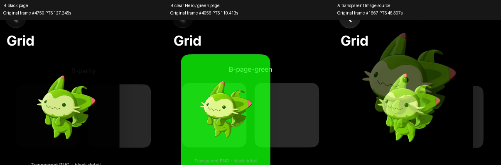

# P0：透明精灵 zoom 的背景与双影隔离实验

> 精选汇总图 `key-comparison.png` 保留版本管理；详细逐帧图和自动报告已迁移到 `build/ios27-p0/docs-evidence/transition-harness/`。指向该目录的相对链接仅本机可用，不随 Git 克隆提供。

日期：2026-10-02（Asia/Shanghai）。Xcode27.0 /27A266a，Swift6.4，iOS27 SDK，iPhone18Pro Simulator27.0 /24A434。生产 bridge、PortraitSurface、PetDetail、App入口均未修改；未进入P1。

**已确认：只注册 UIImageView、只对齐图片 rect，并不让系统页面 zoom 仅合成透明图片。详情 Hero 与页面背景仍进入动画。** 背景颜色不同，使返回末段出现背景矩形与灰 Cell 的切换。当前生产源码没有把整容器错误地作为 source 注册；黑色并非来自原 PNG 的 alpha 丢失。

**边界：本次模拟器录像复现了黑背景矩形，但没有复现真机所描述的严格“最后一个显示帧黑→灰”的突变。** 录像中的透明角落颜色跨多个原始录制帧回到灰色；必须把真机上的精确时序继续列为未验证。不能把系统内部具体 snapshot/crop/portal 实现、或某个最终纹理是否flatten，写成已证明的事实。

## 隔离范围与控制

[工程与运行说明](../../../ios/TransitionHarness/README.md)。独立 App与bundle；仅引用同一张真实透明喵喵PNG；所有变体使用同一解码UIImage。灰 Cell160pt、source图片134.4pt；黑详情、Hero320pt、图片268.8pt；相同比例8%内缩、同样square/aspectFit。A source 修饰符放在 Image 的134.4pt边界内，Cell灰背景与padding在修饰符之外。B复制生产布局与系统导航API，没有调用生产组件。精灵资产与上游数据只读。

没有fixed delay、提前隐藏、手工source alpha修改、自定义crossfade、动画末帧补丁、慢速动画或业务入口。系统zoom自己的合成混合仍如实录制。3轮真实系统Back点击，未以程序化pop代替这次往返。

## 七个问题的回答

1. **黑方块根因是什么？** 在harness中，是系统页面zoom仍合成包含不透明详情背景的画面；这幅画面缩回source区域时，透明PNG周围显示的是详情黑背景，随后Grid灰背景恢复。图片轨迹正确不代表背景轨迹正确。生产源码的结构与此机制一致，足以解释黑块的来源；真机严格末帧跳变的触发时序尚未直接录制。
2. **Hero/container或snapshot带背景了吗？** 是，颜色标记提供直接画面证据：Hero改紫，移动矩形出现紫色；Hero清空、详情root改绿，移动矩形出现绿色。只清Hero背景仍有黑矩形，因此来源不能只归咎于Hero；页面背景也是独立来源。对齐rect不是snapshot裁剪rect。公开属性遍历看到系统morph、replicant、portal与页面hosting视图同时存在，但没有导出系统内部snapshot，不据此指定内部哪张纹理的实现。
3. **PNG被flatten成黑底了吗？** 原资源与单UIImageView的独立截图均有alpha=0像素。B-parity解码PNG有182933个全透明像素，单图片截图有50128个；Hero和root截图alpha全部255。B-clear-hero的Hero截图恢复透明，但root仍不透明。故PNG解码/单UIImageView渲染不是黑底来源；截取或合成带黑背景的祖先时得到黑底完全符合这些结果。系统最终输出本来就是已合成的屏幕，不等于原PNG的alpha被破坏。
4. **alignmentRectProvider对齐什么？** 生产代码返回 `hero.transitionImageView.bounds` 转换到详情VC坐标，harness记录为 `[66.6,141.6,268.8,268.8]`；是完整图片视图边界（含PNG自身透明边），不是精灵非透明像素bbox，也不是320pt Hero容器或全页。source为UIImageView `[43.8,249.133,134.4,134.4]`。UIImageView backgroundColor=nil、isOpaque=false、layer.isOpaque=false、sameImage=true。C-container才故意返回整Hero320pt边界。
5. **纯SwiftUI只共享透明Image是否仍双影/错位？** 是。A-image、A-clear-source均出现两幅不同大小、位置的重叠图像；A-equal即便两端图片同尺寸，也出现错误的临时缩放与双影。把灰Cell从source修饰符移出去、显式透明source配置均未解决。
6. **SwiftUI失败属于哪类？** 最强证据指向目的端几何对齐与合成内容不一致：B-no-alignment只移除alignmentRectProvider，就出现与A相似的双影/错位；保留该rect的B明显更连续。两端image模式、PNG、aspectRatio、padding一致，不能用bitmap不同或aspectFit/Fill不一致解释。页面本身与图片source具有不同尺寸/纵横比/图片位置，默认页面zoom不能自动被当成图片到图片的共享元素。两条可见图像路径由系统合成同时显现是观察结果，但其内部snapshot实现无法由公开日志唯一确定。本次3轮均恢复source、导航完成、生命周期顺序正常，没有应用重复创建路由或提前销毁Hero的证据；这不排除另一个未测试交互的系统生命周期bug。
7. **UIKit只是alignment rect更细才更好吗？** B-no-alignment控制说明alignment rect是这里的决定性几何因素。B还让系统获得真正的UIImageView和同UIImage身份，source在转场中由系统将presentation opacity设0；SwiftUI Image走不同呈现路径。不能声称所有差异都只来自rect，但可以确认rect对于当前构图很关键。它只改善图片连续性，不保证背景透明，也没有解决黑块。

Apple的[alignmentRectProvider定义](https://developer.apple.com/documentation/uikit/uizoomtransitionoptions/alignmentrectprovider)和本机SDK头文件都描述目的端对齐frame，未承诺snapshot裁剪；[WWDC24系统zoom介绍](https://developer.apple.com/videos/play/wwdc2024/10145/)描述Cell向传入页面的转场。这与本次页面背景一起缩放的观察一致。

## A / B / C实际结果

| 变体，每个3轮 | 视觉结果 |
|---|---|
| A-image | 灰Cell背景确实在source外；仍双影/错位及详情背景矩形 |
| A-equal | 图片两端同尺寸仍失败；仅匹配图片大小不够 |
| A-clear-source | 显式透明source配置仍双影；不能认为clear即可让页面成为透明图片共享 |
| B-parity | 图片单一、连续性更好；仍有黑背景矩形 |
| B-clear-hero | PNG与Hero probe透明，root黑；黑矩形仍出现 |
| B-explicit-transparent | 图片/容器显式clear、非opaque仍有黑矩形；opacity默认值不是充分解释 |
| B-hero-magenta | 紫色Hero背景进入移动画面，证明局部容器参与合成 |
| B-page-green | Hero透明，root绿；绿色页面缩回Cell，证明整页背景参与 |
| B-no-alignment | 与A相似的双影/错位；有同UIImageView仍不够 |
| C-black-container | 注册整Cell并对齐整黑Hero：出现矩形容器向灰Cell的变形；未稳定复现严格末帧黑块消失。错误容器source并不是原问题的必要条件 |
| C-black-source-config | 显式黑色source配置可稳定制造黑框，但完成后黑框也保留；并非“完成时黑块突然消失”。这条负对照不能当作原问题已定位到source背景的证据 |

## 逐帧证据



上图为不同变体独立选取的原始帧，不代表严格同一progress或同步的三路录像；绿色块验证页面背景来源，A画面显示双影。

序号为原录像解码帧index，时间为原PTS。缩略contact sheet部分每3帧展示；以下adjacent sheet展示12个连续录制帧，无插帧。完整第一轮所有帧PNG及3轮所有测量在本地build目录，原始录像保留。帧与事件的绝对同步有小量误差，不用它声称某一截图恰好对应didShow；相邻图像的间隔直接取PTS。


完整返回序列：[A-image](../../../build/ios27-p0/docs-evidence/transition-harness/A-image-return.jpg)、[A-equal](../../../build/ios27-p0/docs-evidence/transition-harness/A-equal-return.jpg)、[A-clear-source](../../../build/ios27-p0/docs-evidence/transition-harness/A-clear-source-return.jpg)、[B-parity](../../../build/ios27-p0/docs-evidence/transition-harness/B-parity-return.jpg)、[B-clear-hero](../../../build/ios27-p0/docs-evidence/transition-harness/B-clear-hero-return.jpg)、[B-explicit-transparent](../../../build/ios27-p0/docs-evidence/transition-harness/B-explicit-transparent-return.jpg)、[B-hero-magenta](../../../build/ios27-p0/docs-evidence/transition-harness/B-hero-magenta-return.jpg)、[B-page-green](../../../build/ios27-p0/docs-evidence/transition-harness/B-page-green-return.jpg)、[B-no-alignment](../../../build/ios27-p0/docs-evidence/transition-harness/B-no-alignment-return.jpg)、[C-container](../../../build/ios27-p0/docs-evidence/transition-harness/C-black-container-return.jpg)、[C-black-source-config](../../../build/ios27-p0/docs-evidence/transition-harness/C-black-source-config-return.jpg)。

在B-parity第一轮的固定透明角落(50..55,255..260pt)，RGB从0经8、17、31、37、40、44回到45；在约127.45s已基本灰色，didShow事件约127.995s。所有三轮这个角落都未捕获一次相邻帧0→灰的直接跳变。这个测量只描述该角落，不能证明真机或整个屏幕不存在跳变。画面证据支持背景来源，未关闭真机末帧时序。

## 执行与证据清单

主矩阵：[10/10 passed](../../../build/ios27-p0/docs-evidence/transition-harness/final-test-summary.json)，每项3轮；补录A与C：[4/4 passed](../../../build/ios27-p0/docs-evidence/transition-harness/swiftui-probe-test-summary.json)，每项3轮。11个不同变体，本报告使用7个B/C控制加4个SwiftUI变体的33轮对应证据。导航assertions不是视觉assertions，不把A、C当作共享图片验收通过。[逐变体alpha/帧数量](../../../build/ios27-p0/docs-evidence/transition-harness/evidence-summary.json)。

原始完整证据：`build/ios27-p0/transition-harness/final/`与`swiftui-probe/`，各有screen.mov、tests.xcresult、tests.log、recording.json、probes、analysis/measurements.json与所有第一轮PNG。主矩阵A第一次遥测为0帧，原因是观察器把UIWindow当作root后继续取root.window；补录修正为直接使用UIWindow，A连续显示帧分别667/670/668，系统coordinator活动帧分别308/307/306。**不把此前0帧误写成SwiftUI无coordinator。** 初始一次运行因accessibility容器查询错误被中止(exit -15)，不计成功；matrix目录8/8是早期有效控制，最终结论以final与swiftui-probe为准。

运行命令与工程生成脚本保存在harness目录。`yarn type-check`与`yarn build`通过；Web原有大chunk警告保留。Xcode主矩阵与补录runtimeWarnings均为空；编译只有未使用AppIntents的metadata提示。本任务未改业务逻辑或基础游戏数据，因此未执行数据同步、未重新宣称既有生产18+2回归状态改变。动画早期真实触控返回、最大辅助字体contrast audit仍为原有未关闭P0项。

生产文件开始/结束SHA-1相同：

```text
e8c2ef1340b6b445a4e31af6e0ce82f3280b3fef AlignedNavigation.swift
d2de19c5072ef2a8c21bfd6c289ca1bc7e960f01 PortraitSurface.swift
403b5e1987645410398847fd3139f38ddcd7fded PetDetail.swift
5837378b292c253f454523b2aa54461173880d01 RocoApp.swift
```

**本次结论不授权或建议直接替换生产bridge。** 下一步若继续诊断，应将同一独立harness运行到报告问题的真机，记录原速返回末段，保留A/B颜色控制；在那之前，不把模拟器的渐变解释成真机末帧已解决。
